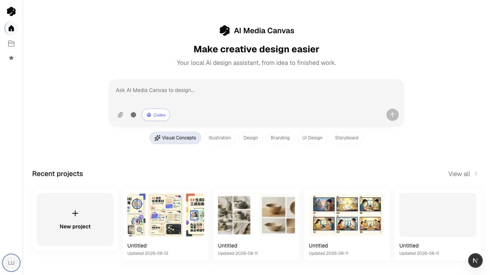

<p align="center">
  
</p>

<h1 align="center">AI Canvas</h1>

<p align="center">
  <strong>本地优先的 AI 创意画布，用于图片与视频创作。</strong>
</p>

<p align="center">
  <a href="#快速开始">快速开始</a>
  ·
  <a href="./README.md">English</a>
  ·
  <a href="./CONTRIBUTING.md">贡献指南</a>
  ·
  <a href="./CODE_OF_CONDUCT.md">行为准则</a>
  ·
  <a href="./SECURITY.md">安全说明</a>
  ·
  <a href="./LICENSE">许可证</a>
</p>

<p align="center">
  <a href="./LICENSE"></a>
  
  
  
  
  
</p>



AI Canvas 是一个本地优先的 AI 创意工作台，用可视化画布组织、生成和迭代图片与视频创意。

它把 Excalidraw 画布、AI 设计助手、本地项目存储、技能工作区和多 Provider 媒体生成能力放在一个单用户 Web 应用里。项目数据存储在 SQLite，生成资源写入本地磁盘。

## 功能

- 可视化画布工作流：基于 Excalidraw 编排、检查和迭代创意内容。
- AI 设计助手：在项目内聊天，并让助手读取或更新画布内容。
- 灵活的 Agent 路线：可使用已登录的本地 Codex 或 Claude Code CLI，也可使用自己的 API key。
- 图片与视频生成：可接入 OpenAI、Google、Replicate、火山方舟、Agnes 等 Provider。
- 本地优先存储：项目、聊天、设置、技能和生成资源都落在本地 SQLite 与文件系统中。
- 技能工作区：导入、创建、启用和复用本地 AI Skills，支持更专门的创意流程。
- 双语界面：基于 `i18next`，当前支持 `zh-CN` 和 `en`。

## 快速开始

环境要求：

- Node.js 22 或更新版本
- pnpm 10.26.2，推荐通过 Corepack 使用

```bash
corepack enable
pnpm install
cp .env.example .env.local
./scripts/start-aimc-dev.sh
```

启动后打开脚本输出的 Web 地址。默认地址：

- Web：`http://localhost:3000`
- Server：`http://localhost:3001`

这个启动脚本会同时启动 Next.js 前端和本地 Fastify 服务。如果端口被占用，会自动选择后续可用端口。

## 单服务模式

如果希望用更接近打包后的方式本地运行，可以先构建静态前端，再由服务端托管：

```bash
pnpm --filter @aimc/web build
AIMC_WEB_DIST=apps/web/out pnpm --filter @aimc/server dev:server
```

然后访问 `http://127.0.0.1:3001/`。

服务端会在同一个进程里提供 `apps/web/out`、`/api/*` 和 `/local-assets/*`。

## 配置 AI Provider

你可以在应用内设置页配置 Provider，也可以通过 `.env.local` 提供默认值。运行时，本地设置页保存的配置优先级高于环境变量。

AI Canvas 支持两种 Agent 执行路线：

- 本地 CLI 路线：使用已经安装并登录的 Codex 或 Claude Code CLI，包括你本机已有订阅覆盖的账号。
- BYOK API 路线：使用自己的 API key 和 Base URL，接入 OpenAI-compatible 网关、Anthropic-compatible Claude 路线、Google Gemini、Vertex AI、Agnes 以及其他已配置 Provider。

常用变量：

```env
AIMC_AGENT_MODEL=openai:gpt-5-mini
AIMC_OPENAI_API_KEY=
AIMC_OPENAI_API_BASE=
AIMC_ANTHROPIC_API_KEY=
AIMC_ANTHROPIC_BASE_URL=
AIMC_AGNES_API_KEY=
AIMC_AGNES_BASE_URL=
AIMC_AGNES_MODEL=
AIMC_GOOGLE_API_KEY=
AIMC_GOOGLE_APPLICATION_CREDENTIALS=
AIMC_GOOGLE_VERTEX_PROJECT=
AIMC_GOOGLE_VERTEX_LOCATION=
AIMC_GOOGLE_VERTEX_VIDEO_LOCATION=
AIMC_REPLICATE_API_TOKEN=
AIMC_VOLCES_API_KEY=
AIMC_VOLCES_BASE_URL=
```

服务与存储变量：

```env
AIMC_SERVER_PORT=3001
AIMC_WEB_ORIGIN=http://localhost:3000
AIMC_SERVER_BASE_URL=http://localhost:3001
AIMC_WEB_DIST=
AIMC_DATA_ROOT=
AIMC_AGENT_BACKEND_MODE=state
AIMC_AGENT_FILES_ROOT=
AIMC_SKILLS_ROOT=
```

## 本地数据

默认情况下，本地运行数据会写入 `local-data/`：

- SQLite 数据库：`local-data/ai-media-canvas.db`
- 生成和上传的资源：`local-data/assets/`

可以通过 `AIMC_DATA_ROOT` 把持久化数据移动到其他目录。

## 工作区结构

```text
apps/
  web/       Next.js 静态导出前端
  server/    Fastify API、本地存储、生成 Provider、Agent Runtime
packages/
  shared/    共享 contract 和 schema
  config/    共享 TypeScript 配置
scripts/     开发、i18n 和打包脚本
docs/        设计说明、计划和项目文档
```

## 致谢

AI Canvas 的产品方向部分参考了 [Loomic](https://github.com/fancyboi999/Loomic) 这个开源 AI 画布创意工作台。Loomic 帮助验证了“画布优先、对话驱动”的媒体创作体验；AI Canvas 保持独立的本地优先架构和实现。

## 开发

常用命令：

```bash
pnpm run lint
pnpm run typecheck
pnpm run test
pnpm check:i18n
pnpm --filter @aimc/web test
pnpm --filter @aimc/server test
```

任何新增或修改的 Web 可见文案，都需要同步更新 `apps/web/src/i18n/locales` 下的所有支持语言，并运行：

```bash
pnpm check:i18n
```

## 贡献

欢迎贡献。提交 Pull Request 前，请先阅读 [CONTRIBUTING.md](./CONTRIBUTING.md)。

如果你要报告安全问题，请查看 [SECURITY.md](./SECURITY.md)。

## 许可证

AI Canvas 使用 [Apache License 2.0](./LICENSE) 开源。
