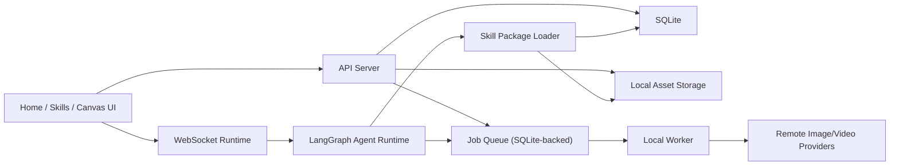

# AI Canvas 单机版能力恢复与本地化改造方案

> 目标不是继续“做减法”，而是先把原始旧源仓库中仍然需要保留的核心产品能力恢复回来，再把这些能力从云端/SaaS 实现迁移到单机本地实现。

## 1. 文档目的

这份文档用于统一后续改造方向，解决当前分支里一个关键偏差：

- 去掉 `Supabase`、`登录`、`支付`、`积分`、`多租户` 这些 SaaS 底座，是正确方向。
- 但在去云化过程中，**图片/视频生成、长任务、后台 worker、重型 Agent runtime、技能包运行时** 这些核心能力被一起删掉了。
- 对于 `AI Canvas` 的目标产品形态来说，这些能力仍然要保留。

因此，后续工作不是简单“继续精简”，而是：

1. **先恢复原始产品能力与接口**
2. **再把这些能力切换到单机本地底座**
3. **最后再做结构优化与体验优化**

## 2. 最终目标

### 2.1 产品目标

交付一个满足以下约束的本地版 `AI Canvas`：

- 单机本地 Web 应用
- 无登录、无注册、无账号体系
- 无支付、无积分、无订阅
- 不依赖 `Supabase`
- 使用 `SQLite` 作为核心结构化数据存储
- 使用本地文件系统作为资产与技能包存储
- 保留接近原始旧源仓库的核心产品能力

### 2.2 必须保留的核心能力

以下能力不应因为“单机化”而消失：

- `/home` 首页结构、示例、灵感、Prompt 进入画布工作流
- `/skills` 的 `已安装 / 市场 / 导入` 三段式能力
- Agent 的真实运行链路，而不是仅返回本地拼装文本
- 图片生成能力
- 视频生成能力
- 长任务系统
- 后台 worker
- 模型偏好与生成模型选择
- WebSocket 实时事件链路
- 技能包运行时能力
- Brand Kit、Projects、Canvas、Chat 之间的联动

### 2.3 明确不保留的 SaaS 能力

以下能力仍然保持删除，不作为恢复目标：

- `Supabase Auth`
- `Supabase Storage`
- `Supabase Postgres / RLS / RPC`
- `Credits / Payments / Pricing`
- `Login / Register / Auth Callback`
- Vercel / Railway / 远端部署平台绑定

## 3. 当前问题总结

## 3.1 当前单机版做对了什么

当前分支已经完成的正确方向包括：

- 产品命名已切换到 `AI Canvas`
- `supabase` / `旧命名` 文案与文件残留已大幅清理
- `/`、`/home`、`/projects`、`/brand-kit`、`/skills`、`/settings` 已本地可访问
- `SQLite + 本地文件` 的基础存储链路已建立
- `/skills` 本地安装/导入/启停基础链路已恢复
- `/home` 的本地 seeds 与示例/灵感结构已恢复

这些工作应被保留，不应回滚。

## 3.2 当前删多了什么

以下模块被删掉后，产品能力出现明显缩水：

### A. 生成与长任务系统

- `apps/server/src/queue/pgmq-client.ts`
- `apps/server/src/worker.ts`
- `apps/server/src/features/jobs/*`
- `apps/server/src/generation/*`
- `apps/server/src/http/generate.ts`
- `apps/server/src/http/jobs.ts`
- `apps/server/src/http/image-models.ts`
- `apps/server/src/http/video-models.ts`
- `apps/server/src/http/models.ts`

### B. 重型 Agent runtime

- `apps/server/src/agent/runtime.ts`
- `apps/server/src/agent/deep-agent.ts`
- `apps/server/src/agent/stream-adapter.ts`
- `apps/server/src/agent/tools/*`
- `apps/server/src/agent/workspace-skills.ts`
- `apps/server/src/ws/*`
- `apps/server/src/http/runs.ts`

### C. 前端对应能力

- 视频生成面板与相关前端链路
- 原始 run lifecycle 对应的前端会话/事件流能力
- 完整的 Agent 工具执行反馈体验

当前本地版 Agent 仅相当于“本地增强回复器”，还不是原始旧源仓库的完整 Agent 工作流。

## 4. 总体改造原则

## 4.1 恢复的是能力，不是照搬旧云端实现

必须明确区分两件事：

- **要恢复的：** 产品能力、接口契约、用户体验
- **不要原样恢复的：** `Supabase`、`PGMQ+Postgres`、多租户权限体系、积分支付体系

例如：

- `PGMQ` 本身不必恢复
- 但“持久化任务队列 + worker + job 状态管理”必须恢复

再例如：

- `workspace-skills` 的 `Supabase` 加载逻辑不必恢复
- 但“Agent 能把已安装 skill 当完整技能包运行时读取”必须恢复

## 4.2 恢复顺序必须先保真，再优化

后续执行遵循以下顺序：

1. **恢复接口和产品能力**
2. **恢复运行链路**
3. **再替换底层实现**
4. **最后做重构优化**

禁止先做大规模重构，再去想“怎样把原能力补回来”。

## 4.3 优先复用原始旧源仓库的接口与流程

在能复用原始旧源仓库代码时，优先考虑：

- 先按原始接口恢复
- 再把实现改接本地底座

而不是：

- 重新设计一套全新接口
- 再让前端/Agent 去适配

这能显著降低功能遗漏和样式/交互偏移风险。

## 5. 建议的总方案

## 5.1 建议路线

推荐采用以下路线：

### 阶段 A：能力回退恢复

从原始旧源仓库中恢复以下系统的“产品能力与接口”：

- 生成 providers / model registry / image & video routes
- job service / worker / queue abstraction
- agent runtime / deep agent / tools / ws
- run lifecycle
- skill package runtime

### 阶段 B：本地化实现替换

把恢复回来的能力从旧底层替换为：

- `Supabase/Postgres/RLS` -> `SQLite`
- `PGMQ` -> `SQLite 持久化任务队列`
- `Supabase Storage` -> 本地文件系统
- `workspace auth/viewer` -> 单机本地 profile/context

### 阶段 C：执行优化

在能力恢复且跑通后，再做：

- 模块拆分
- 代码收缩
- 内部命名本地化
- 性能与稳定性优化

## 5.2 不推荐路线

不推荐继续沿着当前“轻量本地回复链”方向增强，试图逐步长成原系统。

原因：

- 路径会越走越偏
- 最终仍然要回到 run lifecycle / tool runtime / worker / jobs
- 越晚恢复，前端和后端差异会越大
- 后续合并原始旧源仓库能力时冲突会更多

## 6. 目标架构



## 7. 子系统改造方案

## 7.1 生成与长任务系统

### 目标

恢复以下能力：

- 图片生成
- 视频生成
- 模型列表与偏好
- job 提交
- job 查询
- job 重试/失败/取消
- worker 后台执行

### 原始旧源仓库参考面

- [pgmq-client.ts](<legacy-source-repo>/apps/server/src/queue/pgmq-client.ts)
- [worker.ts](<legacy-source-repo>/apps/server/src/worker.ts)
- [job-service.ts](<legacy-source-repo>/apps/server/src/features/jobs/job-service.ts)
- [generation/](<legacy-source-repo>/apps/server/src/generation)
- [http/generate.ts](<legacy-source-repo>/apps/server/src/http/generate.ts)
- [http/jobs.ts](<legacy-source-repo>/apps/server/src/http/jobs.ts)

### 当前单机版缺口

- 没有持久化 job 队列
- 没有 worker 进程
- 没有真实 provider 调用链
- 视频生成基本被去掉
- 生成状态与长任务生命周期不完整

### 单机版恢复策略

#### 恢复接口层

先恢复原始旧源仓库的这些接口形态：

- `/api/models`
- `/api/image-models`
- `/api/video-models`
- `/api/agent/generate-image`
- `/api/agent/generate-video`
- `/api/jobs/*`

#### 替换队列实现

不要恢复 `PGMQ` 本体，改为：

- SQLite `background_jobs` 表
- SQLite `job_attempts` 或内联 attempt 字段
- `status / next_run_at / locked_at / locked_by / last_error`
- 本地 worker 轮询未锁定的 job

#### 替换 worker 执行器

保留原始 worker 的职责结构：

- 队列读取
- 分发到不同 executor
- 成功/失败/重试/死信

但将底层从 `pgmq.*` SQL 函数改为本地 SQLite DAO。

#### 恢复 provider 抽象

恢复原有 provider registry 设计，但允许首批只打开一部分 provider：

- 图片：`OpenAI` / `Replicate` / `Google`
- 视频：至少恢复一个可用 provider

首版可以通过环境变量控制启用哪些 provider，但产品接口应与原始旧源仓库尽量对齐。

## 7.2 Agent runtime / LangGraph / WebSocket

### 目标

恢复以下能力：

- run create / cancel / stream
- canvas-aware agent
- tool calling
- 实时 WS 事件
- thread/session/run 生命周期

### 原始旧源仓库参考面

- [runtime.ts](<legacy-source-repo>/apps/server/src/agent/runtime.ts)
- [deep-agent.ts](<legacy-source-repo>/apps/server/src/agent/deep-agent.ts)
- [workspace-skills.ts](<legacy-source-repo>/apps/server/src/agent/workspace-skills.ts)
- [ws/handler.ts](<legacy-source-repo>/apps/server/src/ws/handler.ts)

### 当前单机版缺口

- 没有真正的 run lifecycle
- 没有真实工具执行链
- 没有流式事件系统
- 首页传来的 prompt 在 canvas 中只是本地回复，不是完整运行链

### 单机版恢复策略

#### 恢复 WS 协议与 run lifecycle

优先恢复原始这些概念：

- `agent.run`
- `agent.cancel`
- canvas resume
- run accepted / running / completed / failed

保留前端现有调用方式的兼容性，但目标是重新回到原始旧源仓库的主链。

#### 恢复 deep agent / tool calling

恢复：

- `inspect-canvas`
- `manipulate-canvas`
- `image-generate`
- `video-generate`
- `brand-kit`
- `project-search`

工具可以先局部恢复，但骨架要按原始旧源仓库的工具体系恢复，不建议继续用“文本模拟工具效果”。

#### 替换持久化

原始：

- `Supabase` / `Postgres checkpointer`

单机版改为：

- SQLite persistence
- 或文件持久化 checkpointer

原则是：

- 保持 `LangGraph` 级别的恢复能力
- 不依赖 `Supabase`

## 7.3 Skill package runtime

### 目标

恢复以下能力：

- 已安装 skill 被当作完整 skill 包看待
- skill 的 `SKILL.md`、`scripts/`、`references/`、`assets/` 都能被 Agent 读取
- Agent 在运行时明确知道应该从哪里读取 skill 包

### 当前单机版状态

当前已经具备：

- SQLite 记录 skill 元数据
- 导入/安装/启停
- Agent 读取 `skillContent`

但还缺：

- 像原始旧源仓库那样把 skill 当成完整运行时包挂载

### 恢复策略

恢复原始 `workspace-skills` 思路，但把实现改成：

- skill 文件存入本地 `skills-data/` 或 SQLite + 文件系统混合
- 运行时将已启用 skills 暴露为本地可读路径
- system prompt 明确要求 Agent 在需要时读取完整 skill 包

## 7.4 `/home` 与 `/skills` 页面

### `/home`

当前已经恢复到较接近原版的结构，应继续保留，并补足：

- 首页 prompt 与完整 run lifecycle 的连接
- 视频模型偏好对 Agent 行为的真实影响
- 示例/灵感数据的本地 seed 丰富度

### `/skills`

当前已经恢复了：

- 已安装
- 市场
- 导入

后续还需继续增强：

- 目录导入后的完整包校验
- 技能详情内对文件清单的展示
- 已安装 skill 与 Agent runtime 的真正绑定

## 8. 分阶段执行方案

## 阶段 0：冻结目标与基线

### 目标

在动“恢复工程”之前，统一好以下边界：

- 不恢复 `Supabase`
- 不恢复登录/支付/积分
- 恢复生成、长任务、worker、Agent runtime、WS、skills runtime

### 产出

- 本文档
- 后续执行清单

## 阶段 1：能力回退恢复

### 目标

把被删掉的**产品能力骨架**先恢复回来。

### 恢复顺序

1. 恢复 server-side generation / jobs / worker 骨架
2. 恢复 models/image-models/video-models/jobs 接口
3. 恢复 agent runtime / ws / runs
4. 恢复 skill runtime
5. 恢复前端对应视频生成、job 轮询、run 事件流组件

### 验收标准

- 前端可以提交图片生成任务
- 前端可以提交视频生成任务
- worker 能消费 job
- agent.run 走真实 runtime
- chat/canvas 收到 WS 流事件
- skill 不只是展示，而是真正参与 runtime

## 阶段 2：本地底座替换

### 目标

把恢复回来的能力逐步替换到本地实现。

### 具体替换

- `PGMQ` -> SQLite queue
- `Supabase` user/admin client -> local service context
- `workspace` 多租户语义 -> local app scope
- `Supabase storage` -> local asset storage
- `workspace skills` DB model -> local skill runtime store

### 验收标准

- 能力不丢
- 外部接口与前端体验基本不变
- 不再依赖 `Supabase`

## 阶段 3：结构优化

### 目标

在能力恢复并稳定后，做代码整理。

### 可做事项

- 清理兼容层命名
- `viewer/profile/workspace_id` 本地化重命名
- 拆分过大的模块
- 减少重复数据结构
- 补更强测试夹具

## 9. 自测校验方案

## 9.1 必跑自动化校验

每完成一个阶段，至少执行：

```bash
pnpm --filter @aimc/shared build
pnpm --filter @aimc/server typecheck
pnpm --filter @aimc/web typecheck
pnpm --filter @aimc/web build
pnpm --filter @aimc/web test
pnpm --filter @aimc/server test
```

若某阶段引入 worker 或 provider，还应增加：

```bash
pnpm --filter @aimc/server dev
pnpm --filter @aimc/server worker
```

或等价本地启动命令。

## 9.2 API 自测清单

### 首页与项目

- `GET /` -> 跳转或落到 `/home`
- `GET /home` -> 200
- `POST /api/projects` -> 成功创建项目
- `/home` Prompt -> 新建 canvas 成功

### Skills

- `GET /api/skills`
- `GET /api/skills/catalog`
- `POST /api/skills/import`
- `POST /api/skills/install`
- `PATCH /api/skills/:id`

### Agent runtime

- `WS /api/ws` 能建立连接
- `agent.run` -> `accepted`
- `running -> completed/failed` 状态正确
- `agent.cancel` 可用

### 图片/视频生成

- `POST /api/agent/generate-image`
- `POST /api/agent/generate-video`
- `GET /api/jobs/:id`
- 失败/重试/取消路径可测

## 9.3 手工回归清单

### 首页

- `/` 进入 `/home`
- 首页 prompt 可开新项目
- 示例卡片点击后可带 prompt 进入 canvas
- 图片/视频模型偏好可生效

### Canvas / Chat

- 新建 session
- 发送消息
- Agent 实时返回
- 刷新后会话恢复
- Brand Kit、skills、attachments 对回答有影响

### 图片生成

- 从画布发起生成
- 生成任务有状态
- 成功后落到 canvas
- 刷新后仍存在

### 视频生成

- 从画布发起生成
- 有长任务状态
- 失败时有明确错误
- 成功后能在项目/画布中找到结果

### Skills

- 本地市场可见
- 本地目录导入成功
- skill 文件结构保留
- 安装/启停后 Agent 行为发生变化

## 10. 风险与注意事项

## 10.1 最大风险

最大的风险不是“恢复代码太多”，而是：

- 一边恢复能力
- 一边继续大规模本地化重构

这样会让问题来源不清晰。

因此建议：

- **先恢复能力跑通**
- **再做底座替换**
- **最后做重构优化**

## 10.2 禁止事项

执行过程中避免以下动作：

- 直接把原始旧源仓库整仓硬拷贝覆盖
- 在恢复前先大改命名与目录结构
- 在未跑通前先继续精简模块
- 用“临时 mock”长期占位核心能力

## 11. 建议的执行优先级

按优先级排序：

1. 恢复 `jobs + worker + providers`
2. 恢复 `WS + agent.run lifecycle`
3. 恢复 `deep agent + tools`
4. 恢复 `skill package runtime`
5. 再做 SQLite/local 底座替换深化
6. 最后做命名/结构优化

## 12. 一句话执行策略

后续改造应遵循这条主线：

> **先把旧源仓库中仍然需要的产品能力恢复回来，再把这些能力逐步从云端实现替换为单机本地实现，而不是继续沿着“轻量本地替代品”方向补丁式演化。**

