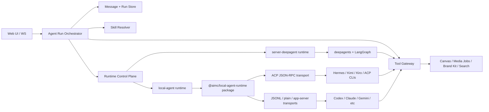

# Agent Runtime 与 Local Agent 集成方案

Date: 2026-06-03
Project: `ai-media-canvas`
Status: Draft

> 实施顺序与阶段交付请先读执行文档：
> [2026-06-04-local-agent-runtime-execution-plan.zh-CN.md](/Users/wwcome/work/demo/ai-media-canvas/docs/2026-06-04-local-agent-runtime-execution-plan.zh-CN.md)

## 目标

`ai-media-canvas` 需要同时保留现有的服务端 deepagent 链路，并新增一种可以调用本地 agent CLI 的链路。这个方案的核心目标是让两种执行方式共享同一套产品语义：

- 同一套 chat session / message / run 展示模型
- 同一套 workspace skill 数据源
- 同一套 canvas、media、brand kit、project search 等业务工具能力
- 同一套权限、计费、审计和事件流协议

结论先行：推荐把现有 deepagent 链路抽象成 `server-deepagent` runtime adapter，再新增 `local-agent` runtime adapter。上层 run orchestration、message persistence、event normalization、tool gateway 不绑定具体 agent 实现。

### 非目标

这版方案不追求一次性替换现有 deepagent，也不把 AIMC 改造成纯本地 daemon / task queue 产品：

- 不下线现有 `server-deepagent`，它仍是默认生产 runtime。
- 不让 local-agent 直接拥有 AIMC canvas/media/credits/workspace 权限。
- 不把 Supabase token、用户 session token、provider API key 暴露给 local CLI。
- 不要求 P0 支持所有 CLI provider；真实 Claude / ACP runtimes 放到 P1+。
- 不要求 local cwd 自动变成 AIMC workspace memory；只有经过 Tool Gateway / artifact reconciliation 的产物才是产品事实。

### 成功标准

方案落地后至少要满足：

- 同一个 chat session 可以选择 `server-deepagent` 或 trusted `local-agent` runtime 执行。
- 两种 runtime 都产出同一套 AIMC `StreamEvent`，UI 不需要另起一套渲染体系。
- `generate_image` / `generate_video` 经 local-agent 调用后仍能展示现有 media tool UI，并可插入 canvas。
- workspace skills 仍以 AIMC workspace DB 为唯一 source，不污染用户全局 skills 目录。
- run accepted 时创建 assistant message anchor，并通过 durable `agent_run_events` 支持 replay / audit / recovery。
- local-agent 工具调用必须经 Tool Gateway 做 schema、权限、token、业务规则校验。
- 如果 local-agent 不稳定，可以关闭 trusted local mode，现有 deepagent 链路不受影响。

## 现有链路复盘

### ai-media-canvas 当前 agent 链路

当前 AIMC 是服务端自己拥有 agent loop：

1. WebSocket 收到 `agent.run` command。
2. `ws/handler.ts` 解析用户、session、model、thread，并调用 `agentRuns.createRun()`。
3. `agent/runtime.ts` 在内存 `Map` 里创建 run，状态为 `accepted`。
4. `streamRun()` 只允许消费一次，把状态切到 `running`，初始化 LangGraph persistence。
5. runtime 加载 workspace skills、构造 deepagents backend、创建 `createAimcDeepAgent()`。
6. `buildUserMessage()` 把 prompt、canvas state、attachments、model preference、mentions 包成 XML 注入给模型。
7. `agent.streamEvents(..., { configurable: { thread_id, canvas_id, access_token, user_id, user_attachment_map } })` 驱动 deepagent。
8. `stream-adapter.ts` 把 deepagent 事件归一化成 AIMC 的 `StreamEvent`。
9. WS handler 把事件推给同 canvas viewers，同时累积 assistant text / tool blocks。
10. run 结束后，WS handler 将 assistant message 写入 chat storage。

关键代码位置：

- Run 创建与流式消费：`apps/server/src/agent/runtime.ts`
- WS 入口与 assistant message 持久化：`apps/server/src/ws/handler.ts`
- Deepagent 创建与 system prompt / tools 注入：`apps/server/src/agent/deep-agent.ts`
- 共享事件与 chat schema：`packages/shared/src/contracts.ts`

这个链路的优势是业务工具、权限、计费都在服务端闭环内，适合云端运行和强管控场景。代价是 agent loop 与 deepagents 强绑定，本地 CLI agent 很难直接复用这套入口。

### ai-media-canvas 的 skills

AIMC 的 workspace skills 已经是数据库驱动：

- `loadWorkspaceSkills()` 通过 canvas -> project -> workspace 找到 workspace。
- 查询启用的 `workspace_skills` 和对应 `skills` 内容。
- 批量加载 `skill_files`。
- 输出 `WorkspaceSkillEntry`，其中 `path` 是 `/workspace-skills/<slug>/SKILL.md`。

deepagent 链路中，runtime 会把这些 skills 写进 LangGraph store 的 `["projects", canvasId, "workspace-skills"]` namespace。`createAimcDeepAgent()` 还会把启用 skill 的名称、描述、虚拟路径、文件摘要注入 system prompt。

这说明 AIMC 的 skill 数据源已经比较适合复用。local agent 不应该另建 skill registry，而应该使用同一批 `WorkspaceSkillEntry`，只是在交付方式上不同：

- deepagent：store route + system prompt mention。
- local agent：materialize 到临时目录、项目 instruction 文件，或 prompt injection。

### ai-media-canvas 的 memory

AIMC 当前有两类 memory：

- 产品 chat memory：`chat_sessions` / `chat_messages`，用于 UI 展示和历史对话。
- Agent working memory：LangGraph `checkpointer` + `store`，用于 deepagent thread state、`/workspace/`、`/memories/`、`/workspace-skills/`。

`createAgentPersistenceService()` 在 `SUPABASE_DB_URL` 存在时创建 Supabase Postgres backed checkpointer / store。`streamRun()` 如果有 `threadId` 但没有 persistence，会直接失败。这对 deepagent 是合理的，但 local agent 不一定有 LangGraph thread state，所以需要把 memory 层分成产品层和 runtime 层。

### ai-media-canvas 的 messages

当前 message 存储更偏“最终结果”：

- 用户消息由 chat API / 前端流程创建。
- assistant message 在 WS streaming 完成后才由 `ws/handler.ts` 创建。
- streaming 期间只在内存和 event buffer 里存在，reconnect 可以通过 canvas event buffer 补一段，但 chat message 没有持久化 `runId`、`runStatus`、`lastRunEventId`。

这个模型对短 run 可以工作，但 local agent CLI 更需要可恢复 run transcript，因为 CLI 输出、工具调用、文件写入、子进程退出都可能跨较长时间发生。建议 AIMC 学 open-design，把 run 与 assistant message 建立更强的持久关系。

### ai-media-canvas 的 tools

AIMC 当前工具是 LangChain `StructuredTool`：

- `project_search`
- `inspect_canvas`
- `manipulate_canvas`
- `generate_image`
- `generate_video`
- `persist_sandbox_file`
- `get_brand_kit`
- `screenshot_canvas`

deepagents 还通过 filesystem middleware 自动注入 `ls`、`read_file`、`write_file`、`edit_file`、`grep`、`glob`、`execute`、`task`、`write_todos` 等工具。backend route 里 `/workspace/`、`/memories/` 走 store，`/skills/` 走 filesystem，default 走 local shell sandbox。

这套工具适合 deepagent 内部调用，但不适合原样给 local CLI，因为 CLI 不能直接拿 LangChain tool object，也不应该直接拿用户 access token。local agent 应该通过 run-scoped tool gateway 访问 AIMC 业务工具。

## open-design local agent 链路对比

open-design 的核心思想是：不要自己重写 agent loop，而是适配用户已经安装的本地 code agent CLI。

### Runtime adapter

OD 的 agent adapter 负责：

- detect：探测 CLI 是否安装、版本、模型列表、能力。
- buildArgs：按不同 CLI 构造启动参数。
- prompt delivery：优先 stdin，规避命令行长度限制。
- stream parser：把 JSONL、ACP JSON-RPC、plain text 等输出映射成统一事件。
- cancel / resume：按 agent 能力处理子进程或 RPC session。

`docs/agent-adapters.md` 明确把 model calls、tool use、context management、permission handling、resume、cancel 交给 CLI agent。daemon 只负责检测、喂 prompt / skill / cwd、转发输出。

### Run 与 message

OD 的 run service 是内存 run registry，但事件是可重放的：

- run 有 `projectId`、`conversationId`、`assistantMessageId`、`agentId`、`status`、`events`、`nextEventId`、`child`、`acpSession`。
- SSE stream 支持 `Last-Event-ID` 和 `after`，可以补发历史事件。
- Web 侧先创建 assistant message，把 `runId`、`runStatus`、`lastRunEventId` 写在 message 上，再不断更新 partial content 和 events。

这对 AIMC 很有参考价值：local agent 链路不应该只在 run 结束后写 assistant message，而应该让 assistant message 从 run accepted 起就是一个 durable anchor。

### Skills

OD 使用 `SKILL.md` 作为基础协议，并支持三种注入方式：

- native skill loading：放到 agent 自己的 skills 目录。
- prompt injection：把 `SKILL.md` 和必要 references 放进 prompt。
- file-placed workflow：写入 `AGENTS.md`、`.cursorrules` 等项目 instruction 文件。

AIMC 可以沿用这个策略，但 skill source 仍然来自当前 workspace skill 数据库。也就是说，AIMC 不需要复制 OD 的 skill discovery，只需要复制 skill delivery 策略。

### Tools

OD 对 local agent 的工具调用不是直接暴露内部服务，而是通过 run-scoped token：

- daemon mint `OD_TOOL_TOKEN`。
- 子进程环境里有 `OD_DAEMON_URL`、`OD_NODE_BIN`、`OD_BIN`、`OD_TOOL_TOKEN`。
- CLI agent 可以通过 wrapper command 或 MCP server 调用 daemon tool endpoints。
- token 有 TTL、allowed endpoints、allowed operations，run 结束或超时后撤销。

这是 AIMC local agent 工具设计最值得借鉴的部分。

## 方案选型

### 方案 A：在现有 `AgentRunService` 里直接塞 local CLI 分支

做法：在 `streamRun()` 中判断 run mode，如果是 local 就 spawn CLI。

优点：

- 改动入口少。
- 可以快速做 demo。

缺点：

- `runtime.ts` 已经承担 deepagent、persistence、billing job closure、skill loading、message event 适配等职责，再塞 CLI 会快速变成大文件。
- deepagent persistence 与 local CLI session state 会混在一起。
- 工具适配和事件解析会污染当前 server-agent 路径。

不推荐作为长期方案。

### 方案 B：完全替换成 open-design daemon 模式

做法：AIMC agent 全部改成本地 daemon + CLI adapter，deepagent 退为 fallback。

优点：

- local-first 体验最纯粹。
- CLI agent 能力利用最大。

缺点：

- AIMC 现有云端链路、计费、媒体生成、canvas 写入、Supabase auth 都会被冲击。
- 当前 deepagent 工具和 LangGraph memory 的投入会被浪费。
- 对 WebSocket、chat persistence、job service 的影响面过大。

不推荐。AIMC 不是纯 local IDE 产品，它有明确的云端业务工具和资产生成链路。

### 方案 C：Runtime Control Plane + Agent Backend Adapter 分层

做法：把原本单层的 runtime adapter 再拆细成两层：

- `Runtime Control Plane`：负责 runtime 注册、检测、心跳、选择、并发、cancel dispatch、runtime recovery。
- `Agent Backend Adapter`：负责 Codex / Claude / ACP runtimes 等 CLI 的启动参数、stdin prompt、stream parser、session resume、capabilities。

现有 deepagent 会成为一个 first-party `server-deepagent` runtime。local-agent 的 CLI/ACP 执行层抽成可复用 package，AIMC 只在应用层绑定 canvas/media/tool 权限。

优点：

- 保留 AIMC 当前生产能力。
- local agent 能以独立 adapter 接入，方便先支持 Codex / Claude Code，再逐步扩展。
- ACP / CLI local-agent 能沉淀成 package，后续其他应用可以复用本地 agent 执行层。
- skills、messages、tools 可以统一在 adapter 外层设计，减少分叉。
- 可以灰度：workspace / user / session 级选择 runtime。

缺点：

- 初始抽象工作比方案 A 多。
- 需要补 run event persistence，否则 local-agent 体验会弱。

推荐方案 C，并将 local-agent 执行层包化。

## 推荐架构



### 1. Agent Run Orchestrator 与 Runtime Control Plane

新增一个上层 orchestrator，负责 run 生命周期，不关心底层是 deepagent 还是 local CLI。orchestrator 下面再放 `Runtime Control Plane`，专门管理 runtime 的可用性和执行资源。

建议接口：

```ts
type AgentRuntimeKind = "server-deepagent" | "local-agent";

type AgentRuntimeRecord = {
  id: string;
  kind: AgentRuntimeKind;
  provider: "deepagent" | "codex" | "claude" | "hermes" | "kimi" | "kiro" | string;
  mode: "server" | "local";
  status: "online" | "offline" | "degraded";
  capabilities: AgentRuntimeCapabilities;
  lastSeenAt?: string;
};

type AgentRuntimeAdapter = {
  runtime: AgentRuntimeRecord;
  capabilities(): AgentRuntimeCapabilities;
  prepare?(context: AgentRunContext): Promise<PreparedAgentRun>;
  run(context: AgentRunContext): AsyncIterable<StreamEvent>;
  cancel(runId: string): Promise<void>;
};
```

orchestrator 负责：

- 创建 run record。
- 创建或更新 assistant message anchor。
- 解析 thread、model、runtime selection。
- 加载 skills。
- 创建 tool grant。
- 调用 runtime control plane 选择 runtime。
- 调用对应 backend adapter。
- 归一化 stream event。
- 持久化 run events、message content blocks、run status。
- cancel / reconnect / replay。

现有 `createAgentRunService()` 可以逐步改造成 orchestrator。第一阶段不需要大重写，可以先把 deepagent 核心逻辑提取到 `server-deepagent-adapter.ts`，保留现有 API。

control plane 负责：

- local runtime detect：env override -> PATH -> login shell fallback -> app bundle fallback -> version/min-version -> model list。
- runtime health：local trusted mode 下注册 provider/runtime 状态，记录 `lastSeenAt`。
- concurrency：每个 runtime 的 max concurrent runs，避免多个长任务同时抢同一 CLI / workspace。
- recovery：子进程异常退出、runtime offline、cancel 后 token revoke、sandbox cleanup。
- selection：根据 run request、workspace 默认值、runtime capability、在线状态选择可用 runtime。

职责边界要写死，避免重新制造一个更大的 `runtime.ts`：

- `Agent Run Orchestrator` 是产品状态 owner。它负责 run 状态机、assistant message anchor、event 持久化、replay、上下文组装、skill delivery 调用和 tool grant 创建。
- `Runtime Control Plane` 不拥有产品状态。它只负责 runtime registry、health、capabilities、selection、concurrency、cancel dispatch 和 recovery signal。
- `Agent Backend Adapter` 不写 DB、不执行业务工具。它只把 `PreparedAgentRun` 交给 deepagent / CLI / ACP，并把底层输出归一化为 `AgentEvent`。
- `Tool Gateway` 是业务工具唯一执行入口。deepagent 和 local-agent 都不能绕过 gateway 直接写 canvas、media、brand kit 或 project search。

run 状态命名也需要统一。建议产品层统一使用 `accepted -> running -> completed | failed | canceled`，因为当前 shared event 已经使用 `run.canceled`，不要在 package 或 DB 里混用 `cancelled`。

### 2. Runtime selection

建议运行时选择优先级：

1. Run request 显式指定 `runtimeKind`。
2. Session / workspace 设置里的默认 runtime。
3. 服务端环境默认值。
4. fallback 到 `server-deepagent`。

local-agent 只应该在本地 daemon / desktop / trusted local server 模式可用。云端部署不应该 spawn 用户机器上的 CLI，也不应该假设存在本地 toolchain。

### 3. Event contract

当前 `StreamEvent` 已经有 `run.started`、`message.delta`、`thinking.delta`、`tool.started`、`tool.completed`、`canvas.sync`、`run.completed`、`run.failed`。建议扩展而不是替换：

- 增加 `run.queued` 或继续使用 `accepted` response。
- 增加 `run.event` persistent id：`eventId` 或 `seq`。
- 增加 `tool.failed`，避免失败工具只能伪装成 `tool.completed`。
- 增加 `artifact.created` / `file.changed` 可选事件，local CLI 文件产物需要表达。
- 增加 `run.adapter.status` 可选事件，用于 CLI detect、spawn、stderr warning。

UI 可以继续按现有事件展示；新字段用于 replay 和 local-agent richer output。

### 3.1 UI 渲染兼容性分析

现有 Web UI 的核心渲染入口是 `StreamEvent -> assistant contentBlocks`。如果 local-agent adapter 能把输出归一化成当前事件子集，UI 基本可以兼容：

| Local agent 输出 | 映射后事件 | 当前 UI 兼容性 |
|---|---|---|
| 普通文本 token | `message.delta` | 兼容，追加到 text block |
| thinking / reasoning | `thinking.delta` | 兼容，追加到 thinking block |
| tool call start | `tool.started` | 兼容，生成 running tool block |
| tool success | `tool.completed` | 兼容，更新 tool block、展示 summary/artifacts |
| canvas 修改 | `canvas.sync` | 兼容，触发 canvas refresh |
| run success | `run.completed` | 兼容，停止 streaming |
| run failed | `run.failed` | 基本兼容，但会把 running tool 伪装成 completed |
| run canceled | `run.canceled` | 基本兼容，但 running tool 也会被伪装成 completed |

因此 local-agent 不需要重写 UI 渲染体系，但要补以下缺口，否则会出现“事件能到 UI，但语义不准确”的问题：

1. `tool.failed` 缺失。当前 shared `StreamEvent` 没有 `tool.failed`，`ToolBlock.status` 也只有 `running | completed`。local gateway 单个工具失败时不能只能发 `run.failed` 或伪装成 `tool.completed`。
2. reducer 需要支持 tool result upsert。local CLI / ACP 有时可能先吐 tool result 或恢复后只补 result；当前 `tool.completed` 找不到已有 tool block 会直接忽略。
3. assistant message id 需要服务端 anchor 化。当前前端发送时用 `assistant-${Date.now()}` 本地 placeholder，reconnect 时用 `resumed_${runId}`；local-agent durable replay 更适合从 ack 或 run record 返回 `assistantMessageId`，UI 直接绑定这个真实 message id。
4. replay 需要 event id / seq 去重。当前 WebSocket resume 主要依赖 canvas ring buffer 和 `lastSeq`；local-agent 长任务要用 `agent_run_events.eventId`，前端 reducer 需要能避免重复应用同一事件。
5. adapter status 不应混成正文。CLI detect、spawn、stderr warning、permission pending、provider auth required 这类状态更适合 `run.adapter.status` 或 toast/subtle status line，不应写成 assistant 正文。
6. file/artifact 事件需要产品化表达。local CLI 可能产出文件、截图、HTML、patch 等非 media artifact。P0 可以先放进 tool output summary；P1 再加 `artifact.created` / `file.changed` 渲染。
7. media artifact 仍应走 `tool.completed.artifacts`。当前 UI 已能在 image/video tool completed 后触发 inline preview 和 canvas insertion callback，local-agent 不应直接发 assistant image block。
8. `run.failed` / `run.canceled` 时 running tool block 应转成 `failed` / `canceled` 视觉状态，而不是 completed checkmark。

建议 UI schema 补强：

```ts
type ToolBlockStatus = "running" | "completed" | "failed" | "canceled";

type ToolFailedEvent = {
  type: "tool.failed";
  runId: string;
  toolCallId: string;
  toolName: string;
  error: { code: string; message: string };
  outputSummary?: string;
  timestamp: string;
};

type AdapterStatusEvent = {
  type: "run.adapter.status";
  runId: string;
  provider: string;
  status: "detecting" | "spawning" | "running" | "warning" | "permission_pending";
  message?: string;
  timestamp: string;
};
```

UI 最小改造建议：

- `use-chat-stream.ts` 增加 `tool.failed` 分支，并让 `tool.completed/tool.failed` 都支持 upsert。
- `ToolBlockView` 增加 failed / canceled icon、颜色、错误摘要和 detail panel。
- `chat-sidebar.tsx` 使用后端返回的 `assistantMessageId` 创建 placeholder，避免 local placeholder 与 durable message anchor 不一致。
- `use-websocket.ts` / replay 逻辑支持 `eventId` 去重，防止 reconnect 后重复追加 delta 或重复插入 tool block。
- 对 `run.adapter.status` 只做轻量状态提示，不进入最终 assistant contentBlocks，除非是 terminal error。

兼容结论：local-agent UI 不需要另起一套，但必须以 `StreamEvent` contract 为唯一入口。只要 adapter 层把 Codex / Claude / ACP 输出先归一化成 AIMC 事件，UI 可以继续复用现有 chat、tool block、media artifact、canvas sync 渲染；缺口集中在 failed 状态、durable message anchor、event replay 去重和 local file/artifact 表达。

### 4. Message 与 run 存储

建议把 assistant message 从“结束后创建”改成“run 创建时创建，过程中更新”。

新增或扩展字段：

- `chat_messages.run_id`
- `chat_messages.run_status`
- `chat_messages.last_run_event_id`
- `chat_messages.events_json`
- `chat_messages.produced_artifacts_json`
- `agent_run_events(run_id, event_id, seq, type, payload, schema_version, idempotency_key, created_at)`

如果短期不想扩 DB 表，至少先在现有 local sqlite / Supabase metadata 里存：

- run status
- last event id
- assistant content blocks snapshot
- terminal error

推荐最终有独立 `agent_run_events`，因为 local CLI 的重连和审计价值更高。

对 local-agent 来说，`agent_run_events` 不应只是最终形态，而是 P0 前置条件。原因是 local CLI / ACP 会出现长任务、断连、重放、工具乱序 result、provider restart，单靠内存 ring buffer 无法保证幂等。

`agent_run_events` 的硬契约：

- `event_id` 全局唯一，或至少在 `run_id` 内唯一。
- `seq` 对同一个 run 单调递增，用于 replay ordering。
- `idempotency_key` 用于工具 result / artifact / canvas mutation 去重。
- `schema_version` 用于后续 StreamEvent contract 演进。
- terminal event 后拒绝继续 append，除非事件类型是明确允许的 late artifact reconciliation。
- payload 落库前做 secret redaction；必要时保留 `redacted_payload` 和审计 hash。
- event projector 根据 events 更新 `chat_messages.content_blocks` snapshot，UI reconnect 时优先从 durable event replay 恢复。

### 5. Skills 设计

保留当前 workspace skill 数据源，新增 `SkillDeliveryService`：

```ts
type SkillDeliveryMode =
  | "deepagent-store"
  | "materialized-files"
  | "prompt-injection"
  | "project-instructions";

type PreparedSkills = {
  promptSummary: string;
  materializedDir?: string;
  extraAllowedDirs: string[];
  cleanup(): Promise<void>;
};
```

deepagent adapter：

- 沿用 `/workspace-skills/<slug>/SKILL.md`。
- 将 skill content 和 files 写入 store namespace。
- system prompt 注入 skill list 和 read path。

local-agent adapter：

- 把 `WorkspaceSkillEntry` materialize 到 per-run sandbox，例如 `.aimc-runs/<runId>/skills/<slug>/SKILL.md`。
- 对支持 native skills 的 CLI，可以 symlink 或 copy 到 agent 可读目录，但第一阶段建议只用 per-run materialize，避免污染用户全局目录。
- prompt 中加入 skill index、selected skills、读取路径。
- 对不支持读外部目录的 CLI，把关键 `SKILL.md` 走 prompt injection，files 仍放到 cwd。

每个 run 都要生成 immutable skill manifest，写入 run metadata 或 `agent_run_events`：

```ts
type RunSkillManifestItem = {
  skillId: string;
  slug: string;
  version?: string;
  contentHash: string;
  filesHash?: string;
  deliveryMode: SkillDeliveryMode;
  materializedDir?: string;
  providerInstructions?: string;
  cleanupPolicy: "on-terminal" | "ttl" | "manual";
};
```

约束：

- run accepted 后 skill snapshot immutable；后续 workspace skill 更新不影响当前 run。
- materialize 路径必须 sanitize slug，拒绝 `..`、绝对路径、symlink escape。
- per-run skills 默认只读，agent 不能修改 DB source。
- provider 只声明 `SkillDeliveryHints`，`skills/*` 按 hints 做纯文件和 prompt 操作，不能反向 import provider 或查询 AIMC DB。
- cleanup 要和 run terminal、process crash、runtime lost 绑定，避免污染用户全局 `~/.codex` / `~/.claude` / 项目根 instructions。

需要同步修正一个现有 schema gap：`runtime.ts` 已经处理 `mentionType: "skill"`，但 `packages/shared/src/contracts.ts` 的 `messageMentionSchema` 还没有 skill mention 分支。这个会影响 skill mention 从客户端合法进入 run request。

### 6. Memory 设计

把 memory 明确拆成四层：

| 层级 | 用途 | deepagent | local-agent |
|---|---|---|---|
| Chat history | UI 对话历史 | `chat_messages` | `chat_messages` |
| Run transcript | replay / audit / recovery | `agent_run_events` | `agent_run_events` |
| Agent working memory | agent 内部状态 | LangGraph checkpointer/store | adapter-specific session id / local transcript |
| Workspace memory | 项目文件、skills、长期记忆 | `/workspace/` `/memories/` store | materialized cwd + Tool Gateway store bridge |

local-agent 不应该强行接入 LangGraph checkpointer。更合理的是：

- 对 CLI 原生 resume 能力，保存 CLI session id 或 adapter resume token。
- 对无 resume 能力的 CLI，保存 compacted conversation summary + recent messages，下一轮重新 prompt。
- 对长期项目记忆，提供 `aimc_memory_read` / `aimc_memory_write` tool gateway，映射到 AIMC store。

Memory ownership/lifecycle：

| 层级 | Owner | 可 handoff | 可 replay | 写入路径 | 说明 |
|---|---|---|---|---|---|
| Chat history | AIMC Orchestrator | 是 | 是 | `chat_messages` | 产品事实，跨 runtime 共享 |
| Run transcript | AIMC Orchestrator | 是 | 是 | `agent_run_events` | 审计、恢复、UI replay 的唯一事实 |
| Agent working memory | Provider adapter | 仅同 provider 视能力 | 否 | `providerSessionId/resumeToken/local transcript` | runtime 私有，不跨 provider 混用 |
| Workspace memory | AIMC Tool Gateway | 是 | 是 | workspace store / artifact store | 只有通过 gateway/persist 后才变成产品事实 |

P0 规则：local cwd 里的文件只是 runtime scratch，不能自动等同于 AIMC workspace memory。只有通过 Tool Gateway 的 memory/file/artifact 工具，或显式 `artifact.created` / `file.changed` reconciliation 后，才进入产品事实并可 handoff。这样可以避免 local-agent 写了本地文件，但 deepagent 或另一个 local runtime 完全看不到。

### 6.1 Session 切换 local agent 与 resume 策略

同一个 AIMC chat session 可以切换到另一个 local agent 继续执行，但这里的“resume”必须分层定义，不能把不同 agent 的内部 session 混用。

需要区分三种能力：

| 场景 | 是否允许 | resume 方式 | 说明 |
|---|---|---|---|
| 同一 provider / 同一 runtime 继续 | 允许 | native resume | 例如 Codex -> 同一个 Codex runtime，可使用 adapter 保存的 `providerSessionId` / resume token |
| 同一 provider / 不同设备 runtime | 视能力允许 | native resume 或 AIMC replay | 如果 provider session id 只在本机有效，必须降级为 AIMC replay |
| 跨 provider 切换 | 允许，但不是 native resume | conversation handoff | 例如 Codex -> Claude / ACP，只能基于 AIMC chat history、run transcript、canvas state、summary 重新构造 prompt |

推荐把 session 状态拆成两层：

```ts
type AgentSessionRuntimeState = {
  sessionId: string;
  runtimeId: string;
  provider: string;
  providerSessionId?: string;
  resumeToken?: string;
  cwd?: string;
  lastRunId?: string;
  lastEventId?: string;
  status: "active" | "detached" | "expired";
};
```

- AIMC `chat_session` 是产品会话，跨 runtime 永远保留。
- `AgentSessionRuntimeState` 是某个 provider/runtime 的内部会话状态，可以有多条。
- `agent_runs` 必须记录本次 run 使用的 `runtimeId`、`provider`、`providerSessionId`、`resumeMode`。
- 切换 runtime 时，不删除旧 runtime state，只把新 run 绑定到新的 runtime state。

`resumeMode` 建议枚举：

```ts
type ResumeMode =
  | "native"        // 同 provider 同 runtime，使用 CLI/ACP 原生 session resume
  | "provider"      // 同 provider 但换 runtime，尽量使用 provider-level resume
  | "handoff"       // 跨 provider，使用 AIMC transcript + summary + canvas state 交接
  | "fresh";        // 不带历史，只使用当前 prompt
```

跨 local agent 切换时，orchestrator 应构造 handoff context：

- 最近 N 条 `chat_messages`。
- 上一次 run 的 compact summary。
- 当前 canvas snapshot / `inspect_canvas` 摘要。
- 最近成功/失败 tool calls，尤其是 `generate_image`、`generate_video`、`manipulate_canvas`。
- workspace skills index。
- 用户当前 prompt。
- 明确提示：这是从 `${previousProvider}` handoff 到 `${nextProvider}`，不要假设能访问前一个 provider 的私有 session/files。

实现策略：

- P0：允许 session 级切换 runtime，但跨 provider 一律 `resumeMode: "handoff"`，不做 native resume。
- P1：同 provider / 同 runtime 支持 native resume，保存 `providerSessionId`。
- P2：支持 runtime state 列表和 UI 展示，例如“此会话曾由 Codex、Claude 执行过”。

限制也要写清：

- 不能把 Codex 的 session id 传给 Claude，或把 ACP session id 传给非 ACP provider。
- 不能默认复用上一个 local-agent 的 cwd，除非 cwd 是 AIMC 创建的 per-run/per-session sandbox 且安全检查通过。
- tool token 不可 resume，每个 run 都必须重新签发。
- materialized skills 不可跨 run 复用为可信输入，每次 run 重新 materialize 或校验 hash。
- 如果前一个 run 仍在 running，切换 runtime 前必须 cancel / detach / fork，不能两个 runtime 同时写同一个 assistant message anchor。

UI 上建议把切换 runtime 当作“同一 chat session 的新 run”，而不是恢复同一个 run。旧 run 的 assistant message 保留，新 run 创建新的 assistant message anchor；如果用户想让另一个 agent 接着未完成 run，应显示为“handoff / continue with another agent”，并在第一条 adapter status 中说明是 handoff。

active run 切换必须显式选择动作：

| 动作 | old run | new run | assistant message | tool token / cwd | canvas write |
|---|---|---|---|---|---|
| `cancel` | 写入 terminal `run.canceled`，停止 provider | 从 durable context 新建 | 新建 anchor | old token revoke，new token 重签 | old lease 释放 |
| `detach` | 允许继续运行，但只能写 old anchor | 不接管 old run | old/new anchor 分离 | old token 按原 run TTL，new token 重签 | 必须有 canvas write lease，避免并发写 |
| `fork` | 保留 old run 当前状态 | 从 last durable event/snapshot 派生 | new anchor 记录 fork source | new cwd 重新创建或从安全 snapshot clone | new run 拿新 lease |

P0 建议只开放 `cancel` 和 `handoff new run`。`detach/fork` 需要更完整的 lease、artifact reconciliation 和 UI 状态，建议 P1 后再开放。

### 7. Tools 设计

把 AIMC 工具拆成两个形态：

- `ToolDefinition`：业务工具的统一 schema、权限、执行函数。
- `ToolBinding`：某个 runtime 下如何暴露工具。

建议先定义内部 tool registry：

```ts
type AimcToolDefinition = {
  name: string;
  description: string;
  inputSchema: unknown;
  aliases?: string[];
  permission: "read" | "write" | "media-job" | "canvas-write";
  execute(ctx: ToolExecutionContext, input: unknown): Promise<ToolResult>;
};
```

工具名称必须以当前代码和 UI 识别的 canonical name 为准：

| Canonical tool name | 用途 | UI 依赖 |
|---|---|---|
| `inspect_canvas` | 读取画布结构和元素 | 普通 tool card |
| `manipulate_canvas` | 修改画布元素 | `canvas.sync` refresh |
| `generate_image` | AI 生图 | 生图 shimmer、image artifact card、canvas insertion callback |
| `generate_video` | AI 生视频 | 视频 shimmer、video artifact card、canvas insertion callback |
| `project_search` | 项目搜索 | 普通 tool card |
| `get_brand_kit` | 品牌工具包读取 | brand kit detail rendering |
| `screenshot_canvas` | 截取画布 | screenshot/image artifact card |

命名策略：

- `AimcToolDefinition.name` 是唯一对外 canonical name，deepagent、local-agent、MCP、HTTP gateway、UI event 都必须使用同一个值。
- 可以在 gateway 层接受 legacy alias，例如 `image_generate -> generate_image`、`video_generate -> generate_video`，但事件输出必须改回 canonical name。
- `tool.started`、`tool.completed`、`tool.failed` 的 `toolName` 必须输出 canonical name，否则 `ToolBlockView` 无法识别生图/生视频专用 UI。
- prompt、skills、tool docs 也要统一使用 canonical name，避免 local-agent 学到旧名称。

alias 规则要更严格：

- `aliases` 是 private inbound-only，只能在 `AimcToolRegistry.resolve()` / Tool Gateway 入站 normalize 阶段生效。
- MCP `tools/list`、HTTP manifest、prompt/tool docs、StreamEvent、run transcript 都不能暴露 alias。
- alias normalize 后必须记录 canonical `toolName`，并把原始 name 放入 audit metadata，不能进入 UI contract。
- `video_generate` 这类 deepagent sub-agent parent tool 不应简单混成 `generate_video` alias。它如果是 orchestration tool，应迁移为内部工具或标注为非业务 media tool，避免 UI 把它当作生视频 artifact tool。

工具发现机制：

- 唯一数据源是 AIMC server 内的 `AimcToolRegistry`，由一组 `AimcToolDefinition` 组成。
- deepagent 通过 `AimcToolRegistry -> LangChain StructuredTool[]` 获取工具，等价于当前 `createMainAgentTools()`。
- local-agent MCP mode 通过 `aimc-tools-mcp` 的 `tools/list` 暴露工具。`tools/list` 返回 `name`、`description`、`inputSchema`，其中 `name` 必须是 canonical name。
- local-agent HTTP wrapper mode 通过 `GET /api/agent-tools/manifest` 或 prompt/tool docs 暴露工具列表，再由 wrapper 调用 `POST /api/agent-tools/<toolName>`。
- Tool Gateway 每次执行前都用 registry 校验 `toolName`、normalize alias、校验 input schema、检查 token allowedTools 和业务权限。
- local agent 不应该自己猜工具名，也不应该从 UI 配置里反推工具名。它只能从 MCP `tools/list` 或 gateway manifest 发现工具。

建议 discovery API：

```ts
type AimcToolManifestItem = {
  name: string;
  description: string;
  inputSchema: unknown;
  permission: "read" | "write" | "media-job" | "canvas-write";
};

type AimcToolRegistry = {
  list(ctx: ToolDiscoveryContext): AimcToolManifestItem[];
  resolve(nameOrAlias: string): AimcToolDefinition | null;
};
```

MCP mode 下：

```text
local agent CLI -> MCP initialize -> MCP tools/list -> sees generate_image/manipulate_canvas/... -> MCP tools/call -> aimc-tools-mcp -> Tool Gateway
```

这里的 MCP `path` / `command` 不是 HTTP 路径，而是 MCP server 的启动描述。例如：

```ts
{
  name: "aimc-tools",
  command: "node",
  args: [aimcToolsMcpServerPath],
  env: {
    AIMC_TOOL_GATEWAY_URL,
    AIMC_TOOL_TOKEN,
    AIMC_RUN_ID: runId,
    AIMC_CANVAS_ID: canvasId,
  },
}
```

`aimcToolsMcpServerPath` 不是业务 API path，也不是 MCP 的 `tools/list` path。它是 AIMC server 在当前部署环境里解析出来的本地可执行入口，指向一个会启动 MCP stdio server 的脚本，例如：

```text
dev:  apps/server/src/agent/local-runtime/mcp/aimc-tools-mcp.ts
prod: apps/server/dist/agent/local-runtime/mcp/aimc-tools-mcp.js
```

更准确地说，`aimc-tools-mcp` 是 AIMC 应用侧的 tool bridge：它从 env 里拿 `AIMC_TOOL_GATEWAY_URL`、`AIMC_TOOL_TOKEN`、`AIMC_RUN_ID`、`AIMC_CANVAS_ID`，对 local agent 暴露 MCP `tools/list` / `tools/call`，再把真实调用转发给 AIMC Tool Gateway。`@aimc/local-agent-runtime` 不应该内置 AIMC 业务工具，只需要原样接收并传递 `mcpServers` 配置。

MCP 角色要拆清楚：

| 角色 | 职责 | 不做什么 |
|---|---|---|
| AIMC Orchestrator | 生成 `mcpServers`、签发 tool grant、创建 assistant message anchor | 不主动发 `tools/list` |
| Provider adapter | 把 `McpServerConfig[]` 转成 CLI 原生 config 或 ACP `mcpServers` | 不解析 AIMC 工具 schema |
| CLI / ACP agent | 作为 MCP client，启动 `aimc-tools-mcp` 并发 `initialize/tools/list/tools/call` | 不直接写 AIMC DB |
| `aimc-tools-mcp` | 作为 MCP stdio server，响应工具发现和调用 | 不保存工具清单事实，不做业务授权决策 |
| Tool Gateway | 校验 token、权限、schema，执行真实 AIMC 工具 | 不信任 local agent 传入的 user/canvas/project id |

如果后续把 `aimc-tools-mcp` 也做成可执行 bin，可以把上面的配置改成：

```ts
{
  name: "aimc-tools",
  command: "aimc-tools-mcp",
  args: [],
  env: {
    AIMC_TOOL_GATEWAY_URL,
    AIMC_TOOL_TOKEN,
    AIMC_RUN_ID: runId,
    AIMC_CANVAS_ID: canvasId,
  },
}
```

local agent 或 ACP provider 会根据这段配置启动一个 `aimc-tools-mcp` 子进程，然后通过 stdio JSON-RPC 调 MCP 方法：

```json
{"jsonrpc":"2.0","id":1,"method":"initialize","params":{...}}
{"jsonrpc":"2.0","id":2,"method":"tools/list","params":{}}
{"jsonrpc":"2.0","id":3,"method":"tools/call","params":{"name":"generate_image","arguments":{...}}}
```

`aimc-tools-mcp` 收到 `tools/list` 后，不自己维护工具清单，而是调用 AIMC Tool Gateway 的 manifest 或直接加载注入的 `AimcToolRegistry`，返回 canonical tools：

```json
{
  "tools": [
    {
      "name": "generate_image",
      "description": "Generate an image using AI...",
      "inputSchema": { "type": "object", "properties": { "...": "..." } }
    }
  ]
}
```

谁发 `tools/list` 取决于 provider：

- 支持 MCP 的 Codex / Claude 类 CLI：CLI 自己作为 MCP client，启动 `aimc-tools-mcp` 并发 `tools/list`。
- ACP provider：AIMC 把 `mcpServers` 放进 ACP `session/new`，ACP agent 负责启动 MCP server 并发 `tools/list`。
- 不支持 MCP 的 provider：不走 `tools/list`，退化到 HTTP wrapper manifest。

HTTP wrapper fallback 下：

```text
prompt includes allowed tool manifest -> agent calls wrapper generate_image -> wrapper POSTs /api/agent-tools/generate_image -> Tool Gateway
```

deepagent binding：

- 将 `AimcToolDefinition` 包装成 LangChain `StructuredTool`。
- 继续复用现有 `createMainAgentTools()` 的实现。

local-agent binding：

- mint run-scoped `AIMC_TOOL_TOKEN`。
- 暴露 HTTP endpoints：`/api/agent-tools/<toolName>`，作为最终业务工具执行入口。
- 提供 MCP server：`aimc-tools-mcp`，给支持 MCP 的 CLI 使用。
- tool token 限定 runId、canvasId、userId、allowedTools、expiresAt。
- run terminal 后撤销 token。

`AIMC_TOOL_GATEWAY_URL` 和 `AIMC_TOOL_TOKEN` 的作用不是替代 MCP，而是保护 Tool Gateway。MCP server 本身也需要调用 AIMC Tool Gateway，所以它需要 run-scoped URL/token。区别在于 token 放在哪里：

| Tool binding mode | 谁持有 `AIMC_TOOL_TOKEN` | local agent 如何调用 |
|---|---|---|
| MCP mode，推荐 | `aimc-tools-mcp` 子进程 env | CLI 只看到 MCP tools，不直接看到 token |
| HTTP wrapper mode，兼容 | wrapper command env | CLI 调用 wrapper，wrapper 再调 `/api/agent-tools/<toolName>` |
| direct HTTP mode，不推荐 | agent CLI env | CLI 可直接看到 token，除非 provider 不支持 MCP/wrapper，否则不要用 |

因此 P0 优先设计为：`mcpServers` 里配置 `aimc-tools-mcp`，并把 `AIMC_TOOL_GATEWAY_URL`、`AIMC_TOOL_TOKEN`、`AIMC_RUN_ID`、`AIMC_CANVAS_ID` 放进 MCP server 的 env，而不是直接放进整个 local-agent CLI env。只有在 provider 不支持 MCP 时，才退化到 HTTP wrapper mode。

安全威胁模型：即使 token 只放在 `aimc-tools-mcp` env，也不能把它当作 provider 完全不可见的 secret。ACP provider / CLI 通常会收到完整 MCP server 启动配置，并有能力启动子进程；因此 local-agent 只允许在 trusted local mode 开启。`AIMC_TOOL_TOKEN` 必须是最小权限临时凭证：

- 绑定 `runId`、`canvasId`、`userId`、`workspaceId`、`allowedTools`、`audience`。
- 短 TTL，run terminal / cancel / crash recovery 时 revoke。
- 每次 `tools/call` 都从 token claims 和 run record 派生 user/canvas/project，不信任参数里的同名字段。
- schema/auth/permission/provider 错误必须无副作用，并表达为 `tool.failed`。
- stdout/stderr、event payload、env dump、adapter status 必须做 redaction。
- 绝不传 Supabase token、user session token、provider API key 给 local agent。

### 7.1 Media tool result 与 UI contract

local-agent 通过 MCP 调 `generate_image` / `generate_video` 后，UI 能否复用现有生图/生视频渲染，取决于 Tool Gateway 输出是否满足同一套 StreamEvent contract：

```text
tool.started(toolName=generate_image, input)
tool.completed(toolName=generate_image, output, artifacts=[image artifact])
canvas.sync(optional, if backend already inserted element)
```

建议把 media 工具结果收敛为统一 contract：

```ts
type MediaToolResult = {
  status: "succeeded" | "failed" | "pending";
  summary: string;
  artifacts?: ToolArtifact[];
  error?: { code: string; message: string };
  job?: {
    jobId: string;
    type: "image_generation" | "video_generation";
    status: "running" | "completed" | "failed" | "canceled";
  };
  canvasMutation?: {
    mode: "server-inserted" | "client-insert-fallback" | "none";
    elementId?: string;
    placement?: { x: number; y: number; width: number; height: number };
  };
};
```

`generate_image` 成功时必须产出 image artifact：

```ts
{
  type: "image",
  url,
  mimeType,
  width,
  height,
  title,
  jobId,
  placement,
}
```

`generate_video` 成功时必须产出 video artifact，并带 `durationSeconds`。不要只把 `imageUrl` / `videoUrl` 塞进 `output` 后让 stream adapter 猜字段；Tool Gateway 应直接返回 `artifacts`，adapter 只负责透传和 canonicalize。

event mapping：

- schema/auth/permission/provider tool error -> `tool.failed`，不是 `run.failed`。
- adapter fatal、provider process crash、无法继续读取协议 -> `run.failed`。
- media job 创建成功但阻塞等待超时 -> `tool.completed` with `output.job.status = "running"`，后续通过 `artifact.created` / `media.job.updated` / replay reconciliation 补齐。
- run cancel 时必须决定 media job 是 cancel 还是 detach，并写入 event。
- backend 已插入 canvas 时设置 `canvasMutation.mode = "server-inserted"` 并发 `canvas.sync`；否则 UI 用 artifact 做 client insertion fallback，避免重复插入。
- replay 时 `tool.completed` / `tool.failed` 必须 upsert，即使没有 prior `tool.started` 也能生成可渲染 tool block。

第一阶段 local-agent tool set 不需要一次支持所有工具。建议 P0 支持：

- `inspect_canvas`
- `manipulate_canvas`
- `generate_image`
- `generate_video`
- `project_search`

`screenshot_canvas` 依赖前端连接和 RPC，可以作为 P1。

### 8. 可复用 local-agent-runtime package

local-agent 执行层应该抽成独立 workspace package，建议命名为：

```text
packages/local-agent-runtime
```

这个 package 的目标是给 AIMC 和后续其他应用复用本地 agent 执行能力。它只处理“如何驱动本地 agent CLI”，不处理 AIMC 业务权限。

package 应包含：

- CLI detection：可执行文件解析、版本检测、最低版本校验、模型列表探测。
- process runtime：spawn、stdin prompt、stdout/stderr byte/line stream、timeout、cancel、stderr tail、exit/signal。
- transports：`acp-json-rpc`、`jsonl`、`plain`、`codex-app-server`。
- adapters：`codex`、`claude`、`generic-acp`，后续扩展 `hermes`、`kimi`、`kiro`、`gemini`。
- event normalization：输出统一 `AgentEvent`。
- skill helpers：materialize skills、prompt injection、provider-aware skill dir。
- MCP helpers：把应用传入的 MCP config 转成 ACP `mcpServers` 或 CLI 原生 config。

package 不应包含：

- AIMC canvas 操作。
- media job / credits / tier guard。
- Supabase auth / workspace permission。
- chat message / run event DB 写入。
- `AIMC_TOOL_TOKEN` 签发与校验。

这些必须留在 AIMC 应用层，因为它们是业务边界。

建议 package API：

```ts
export type LocalAgentRuntime = {
  detect(): Promise<AgentDetection>;
  listModels?(): Promise<AgentModel[]>;
  run(input: AgentRunInput): AsyncIterable<AgentEvent>;
  cancel(runId: string): Promise<void>;
};

export type AgentRunInput = {
  runId: string;
  provider: string;
  cwd: string;
  prompt: string;
  systemPrompt?: string;
  model?: string;
  env?: Record<string, string>;
  mcpServers?: McpServerConfig[];
  timeoutMs?: number;
  signal?: AbortSignal;
  metadata?: Record<string, unknown>;
  resume?: {
    mode: "native" | "provider" | "handoff" | "fresh";
    providerSessionId?: string;
    resumeToken?: string;
  };
};

export type AgentEvent =
  | { type: "status"; status: "initializing" | "running" | "completed" }
  | { type: "text_delta"; text: string }
  | { type: "thinking_delta"; text: string }
  | { type: "tool_call"; id: string; name: string; input?: unknown }
  | { type: "tool_result"; id: string; status: "completed" | "failed"; output?: unknown; error?: string }
  | { type: "usage"; usage: unknown }
  | { type: "error"; message: string }
  | { type: "done"; status: "completed" | "failed" | "canceled"; sessionId?: string };
```

如果目标是后续可对外发包，不建议把 detection、transport、process lifecycle、provider parser、permission policy 全部压进一个 `LocalAgentRuntime` 大接口。更稳的 public contracts 是：

```ts
export interface LocalAgentProviderPlugin {
  id: string;
  displayName: string;
  supportedTransports: TransportKind[];
  detect(ctx: DetectContext): Promise<DetectionResult>;
  createAdapter(ctx: ProviderInitContext): ProviderAdapter;
}

export interface ProviderAdapter {
  buildLaunchPlan(input: AgentRunInput): Promise<LaunchPlan>;
  parseEvents(stream: RawAgentStream): AsyncIterable<AgentEvent>;
  capabilities(): AgentRuntimeCapabilities;
}

export interface Transport {
  kind: TransportKind;
  run(plan: LaunchPlan, signal: AbortSignal): AsyncIterable<RawAgentEvent>;
}
```

ownership matrix：

| 能力 | Owner | 说明 |
|---|---|---|
| command resolution / executable path | provider | 按 provider 解析 CLI 命令 |
| version / min-version / auth required | provider | 输出 `DetectionResult` |
| model list / capability detection | provider | control plane 只缓存 |
| runtime health / selection / concurrency | control plane | 不写 message/run DB |
| process spawn / cancel / stderr tail | process | 不解析协议语义 |
| JSONL/plain/ACP wire protocol | transport | 只处理协议生命周期 |
| provider-specific parser / normalization | provider | 把 raw event 归一成 `AgentEvent` |
| native resume token 是否可用 | provider | orchestrator 负责持久化 |
| handoff resume | orchestrator | 不能由 transport 自行决定 |
| tool grant mint / validate | AIMC Tool Gateway | 不进入 package |

transport contract：

| Transport | 输入 | 输出 | 适用场景 | 备注 |
|---|---|---|---|---|
| `jsonl` | `LaunchPlan` + stdio lines | raw JSON events | Codex / Claude 类 JSONL CLI | parser 在 provider/transport adapter |
| `plain` | prompt stdin / argv | text chunks + stderr | 最低兼容 CLI | 只能产出 text/status，工具能力受限 |
| `acp-json-rpc` | ACP JSON-RPC over stdio | `session/update` raw events | Hermes/Kimi/Kiro/ACP providers | 负责 request id correlation、timeout |
| `codex-app-server` | local app-server URL / launch plan | HTTP/WebSocket/SSE events | Codex desktop/app-server bridge | P0 需要先定义为 experimental，不影响 JSONL P0 |

`codex-app-server` 如果暂时无法准确定义，应从 P0 必选 transport 中移除或标注 experimental。它不能只是 transport 列表里的名字，必须明确是长驻本地 server、Codex desktop bridge，还是一次性子进程协议。

对上层应用的默认入口应该只有一个：

```ts
import {
  createLocalAgentRuntime,
  codexProvider,
  claudeProvider,
  genericAcpProvider,
} from "@aimc/local-agent-runtime";
```

也就是说，AIMC server 和后续普通应用只依赖 `@aimc/local-agent-runtime`。其他包是内部实现拆分或高级插件作者入口，不应该要求业务应用逐个理解。

推荐发布形态：

| 包名 | 使用者 | 作用 |
|---|---|---|
| `@aimc/local-agent-runtime` | AIMC / 上层应用 | facade 包，默认入口，内置官方 providers，并重导必要 core contracts |
| `@aimc/local-agent-core` | provider 作者 / runtime 维护者 | contracts、events、errors、capabilities、registry、skill/MCP types |
| `@aimc/local-agent-process` | runtime 内部 | spawn supervisor、cancel、timeout、stderr tail |
| `@aimc/local-agent-transport-acp` | ACP provider 作者 / runtime 内部 | ACP JSON-RPC transport |

拆包产物要按阶段看：

| 阶段 | 实际发布 / workspace 包 | 说明 |
|---|---|---|
| P0 | `@aimc/local-agent-runtime` | 唯一上层入口；内部按 `core/process/transports/providers` 分目录，不物理拆包 |
| P1 | 仍是 `@aimc/local-agent-runtime` | 增加 Claude / generic ACP / fake provider，继续内置官方 providers |
| P2 可选 | `@aimc/local-agent-core` | 当第三方 provider 作者需要稳定 contracts 时再拆 |
| P2 可选 | `@aimc/local-agent-transport-acp` | 当多个外部 ACP provider 复用 ACP transport 时再拆 |
| P2 可选 | `@aimc/local-agent-process` | 当 process supervisor 需要被其他 runtime 复用或独立测试发布时再拆 |
| P3 可选 | `@aimc/local-agent-provider-*` | 第三方或重依赖 provider 才单独发；官方 Codex/Claude 不优先拆 |

P0/P1 不建议单独发布 `@aimc/local-agent-adapter-codex`、`@aimc/local-agent-adapter-claude` 这类官方 adapter 包。Codex / Claude / generic ACP providers 先放进 `@aimc/local-agent-runtime` 一个包里，通过内部目录分层保持边界：

```text
packages/local-agent-runtime/src/
  core/
  process/
  transports/acp/
  providers/codex/
  providers/claude/
  providers/generic-acp/
  index.ts
```

建议 P0 目录结构：

```text
packages/local-agent-runtime/
  package.json
  tsconfig.json
  src/
    index.ts

    runtime/
      create-runtime.ts
      provider-registry.ts
      detection-cache.ts

    core/
      events.ts
      errors.ts
      capabilities.ts
      provider-plugin.ts
      registry.ts
      run-input.ts
      mcp.ts
      skills.ts
      redaction.ts

    process/
      supervisor.ts
      command-resolver.ts
      env.ts
      cancellation.ts
      stderr-buffer.ts

    transports/
      jsonl/
        jsonl-transport.ts
        jsonl-parser.ts
      plain/
        plain-transport.ts
      acp/
        acp-client.ts
        acp-jsonrpc.ts
        acp-models.ts
        acp-permissions.ts
        acp-session.ts
        acp-types.ts

    providers/
      codex/
        index.ts
        detect.ts
        launch-plan.ts
        parser.ts
        models.ts
      claude/
        index.ts
        detect.ts
        launch-plan.ts
        parser.ts
        models.ts
      generic-acp/
        index.ts
        provider.ts

    skills/
      materialize.ts
      prompt-injection.ts
      cleanup.ts

    testing/
      fake-provider.ts
      fake-acp-peer.ts
      fixtures.ts

  tests/
    core/
    process/
    transports/
    providers/
    integration/
```

public exports 控制：

```ts
// src/index.ts
export { createLocalAgentRuntime } from "./runtime/create-runtime";
export { fakeProvider } from "./testing/fake-provider";
export { codexProvider } from "./providers/codex";

export type {
  AgentEvent,
  AgentRunInput,
  AgentRuntimeCapabilities,
  LocalAgentProviderPlugin,
  ProviderAdapter,
  TransportKind,
} from "./core";
```

P1 再把 `claudeProvider`、`genericAcpProvider` 加入稳定 public exports。P0 可以有内部目录和实验实现，但不对外承诺 API。

默认不从 `index.ts` 导出 `process/*` 和 transport internals。这样上层不会依赖 child process 或 ACP JSON-RPC 细节。测试工具可以用 subpath export 暴露：

```json
{
  "exports": {
    ".": "./dist/index.js",
    "./testing": "./dist/testing/index.js"
  }
}
```

依赖规则：

- `core/*` 不能依赖 `providers/*`、`transports/*`、`process/*`。
- `runtime/*` 负责 facade composition，可以依赖 `core/*`、`providers/*`、`transports/*`、`process/*`。
- `process/*` 不能依赖 provider / transport parser，只负责进程生命周期和原始 stream。
- `transports/*` 可以依赖 `core/*` 和 `process/*`，但不能依赖 AIMC 应用。
- `transports/*` 不做 provider-specific normalization。
- `providers/*` 可以依赖 `core/*`、`process/*`、对应 transport，负责 launch plan、capability、model mapping、parser/normalizer。
- `skills/*` 只处理文件 materialize / cleanup / prompt injection，不查 AIMC DB，不反向依赖 provider。
- `testing/*` 可以依赖所有 runtime 内部模块，但只能通过 `./testing` subpath 给外部测试使用。

AIMC 应用层放在 server 内，不进入 package：

```text
apps/server/src/agent/local-runtime/
  aimc-local-agent-adapter.ts
  aimc-tool-gateway.ts
  aimc-tool-definitions.ts
  aimc-event-mapper.ts
  aimc-skill-delivery.ts
  aimc-runtime-control-plane.ts
```

这样 package 负责“驱动本地 agent”，AIMC server 负责“业务权限、工具执行、message/run 持久化、StreamEvent 映射”。

这样上层依赖简单，版本也好控。adapter 单独拆包只作为未来选项，触发条件是：

- 第三方 provider 插件生态开始出现，需要单独安装 provider。
- 某个 provider 依赖很重，放在 runtime 里会显著增加安装体积。
- 某个 CLI 输出频繁变更，需要独立版本节奏。
- runtime core 已经稳定，不希望 provider 变更影响 facade 包发布。

拆 core/process/transport 的原因不是让上层多 import，而是为了降低维护风险：

- `core` 保持稳定 contracts，减少 semver 破坏。
- `process` 隔离 Node child process / cancel / timeout 细节，便于测试。
- `transport-acp` 隔离 ACP JSON-RPC 协议，避免污染 Codex/Claude JSONL adapter。
- `runtime` facade 负责把默认官方 adapters 组装好，给普通应用一个简单入口。

P0 public export 建议先收敛为 `fakeProvider`、`codexProvider`、`createLocalAgentRuntime` 和 plugin registration contract。`claudeProvider`、`genericAcpProvider` 可以在目录和设计里保留，但不到实现完成前不作为稳定 public API 承诺。

上层典型使用方式：

```ts
const runtime = createLocalAgentRuntime({
  providers: [
    codexProvider(),
    claudeProvider(),
    genericAcpProvider({
      id: "hermes",
      command: "hermes",
      args: ["acp"],
    }),
  ],
  redactor: aimcSecretRedactor,
});

const detection = await runtime.detect();

const stream = runtime.run({
  runId,
  provider: "codex",
  cwd: sandbox.cwd,
  prompt: preparedPrompt,
  mcpServers: [
    {
      name: "aimc-tools",
      command: "node",
      args: [aimcToolsMcpServerPath],
      env: {
        AIMC_TOOL_GATEWAY_URL,
        AIMC_TOOL_TOKEN,
        AIMC_RUN_ID: runId,
        AIMC_CANVAS_ID: canvasId,
      },
    },
  ],
  signal,
});

for await (const agentEvent of stream) {
  yield mapAgentEventToAimcStreamEvent(agentEvent);
}
```

如果只做 AIMC 内部 P0，建议只有一个 workspace package `packages/local-agent-runtime`，内部目录按 `core/`、`process/`、`transports/acp/`、`providers/codex/` 拆。等 API 稳定且确实有外部生态需求后，再决定是否物理拆成多个 npm 包。

这样 provider plugin 只处理“这个 CLI 怎么启动、怎么读输出、有什么能力”，宿主应用只处理“这个 run 允许调用哪些业务工具”。ACP 类 provider 可以共享 `@aimc/local-agent-transport-acp`，只覆盖 command、model mapping、permission mapping 和 provider-specific normalization。

package 的 error taxonomy 也需要成为 public contract：

- `detection_failed`
- `unsupported_version`
- `spawn_failed`
- `protocol_error`
- `permission_denied`
- `tool_error`
- `timeout`
- `canceled`
- `provider_auth_required`
- `provider_rate_limited`
- `unknown_provider_error`

### 8.1 SDK 给 open-design 复用的可行性

结论：可以复用，但只能复用 local-agent runtime SDK 的“本地 agent 执行层”，不能把 AIMC 应用层一起带过去。open-design 当前 daemon 已经有非常相似的结构：`apps/daemon/src/agents.ts` 维护 `AGENT_DEFS`、PATH detection、model list、`buildArgs`、`streamFormat`；`apps/daemon/src/acp.ts` 已有 ACP JSON-RPC lifecycle；daemon 还会生成 live artifacts MCP server 配置。SDK 如果保持 host-agnostic，open-design 可以逐步用它替换这部分重复执行层。

可直接复用：

| SDK 能力 | open-design 对应现状 | 复用方式 |
|---|---|---|
| CLI detection / version / model list | `AGENT_DEFS` + `detectAgents()` | 用 provider plugin 替代手写 probe |
| process runtime | chat handler 手写 `spawn` / stdin / stderr tail | 用 `process/*` 统一 spawn/cancel/timeout |
| transports | `claude-stream-json`、`json-event-stream`、`plain`、`acp-json-rpc` | SDK 提供 JSONL/plain/ACP transport |
| ACP JSON-RPC | `apps/daemon/src/acp.ts` | 提炼为 `transports/acp`，OD 只传 `mcpServers` |
| provider adapters | Claude/Codex/Qoder/Copilot/Pi 等 `buildArgs` | 逐步迁移到 provider plugin |
| MCP helpers | `buildLiveArtifactsMcpServersForAgent()` | OD 继续生成自己的 live-artifacts MCP config，SDK 只负责转交给 provider |
| skill helpers | `.od-skills/<id>` staging、prompt injection | SDK 可复用文件 materialize/prompt injection primitives |
| AgentEvent normalization | OD 各 parser 映射到 UI events | 先统一成 SDK `AgentEvent`，OD 再映射成自己的 SSE/UI event |
| fake provider tests | OD 当前大量真实 CLI 兼容风险 | 用 fake provider/fake ACP peer 做 conformance |

不能直接复用，必须留在 open-design host 层：

| AIMC 方案中的能力 | open-design 为什么不能直接用 |
|---|---|
| AIMC Tool Gateway | OD 有自己的 live artifacts/tools/connectors/media dispatcher |
| `AimcToolDefinition` canonical tools | OD 工具名和产物语义不是 canvas/media/job 那套 |
| `MediaToolResult` | 只对 AIMC `generate_image/generate_video` UI contract 有意义 |
| `agent_run_events` DB schema | OD 有自己的 transcript / persisted event 结构 |
| Runtime Control Plane | OD daemon 是本机常驻进程，不一定需要 AIMC 的 runtime registry/heartbeat/claim 模型 |
| workspace DB skills source | OD skills 是文件系统扫描，不是 AIMC workspace DB |
| canvas write lease / credits / tier guard | AIMC 业务权限，OD 没有这层语义 |

因此如果目标是让 open-design 直接使用，SDK public API 要避免 AIMC 命名和业务概念：

- `@aimc/local-agent-runtime` 可以作为 AIMC 内部包名，但对外建议改成中性包名，例如 `@local-agent/runtime`、`@agent-runtime/local` 或 `@open-agent/runtime`。
- `AimcToolDefinition`、`AIMC_TOOL_TOKEN`、`AIMC_TOOL_GATEWAY_URL` 不进入 core SDK，只作为 AIMC host binding 示例。
- core SDK 只保留 `AgentRunInput`、`AgentEvent`、`ProviderPlugin`、`Transport`、`McpServerConfig`、`SkillDeliveryHints`、`ProcessSupervisor`。
- host 应用自己实现 `ToolBridge`、`SkillSource`、`EventMapper`、`RunStore`。

建议抽一个 host adapter contract：

```ts
type LocalAgentHostAdapter = {
  prepareRun(input: HostRunRequest): Promise<AgentRunInput>;
  prepareSkills?(input: HostRunRequest): Promise<PreparedSkills>;
  buildMcpServers?(input: HostRunRequest): Promise<McpServerConfig[]>;
  mapEvent(event: AgentEvent): HostStreamEvent;
  persistEvent?(event: AgentEvent): Promise<void>;
  redact?(value: unknown): unknown;
};
```

AIMC 的 host adapter 会接 Tool Gateway、workspace DB skills、`StreamEvent`、`agent_run_events`。open-design 的 host adapter 会接 `.od-skills`、design systems、live artifacts MCP、SSE event、transcript export。

open-design 的迁移建议：

1. 先把 SDK 作为内部依赖引入，只替换 `acp-json-rpc` transport 和 process supervisor。
2. 再把 Codex/Claude provider 的 detection/buildArgs/parser 迁到 SDK provider plugin。
3. 保留 OD 的 `buildLiveArtifactsMcpServersForAgent()`，把结果作为 `mcpServers` 传给 SDK。
4. 保留 OD skills/design-system staging，只复用 SDK 的 path sanitize、materialize、prompt-injection helper。
5. 最后把 OD 的 `AgentEvent` 与 SDK `AgentEvent` 对齐，减少 `claude-stream.ts`、`copilot-stream.ts`、`qoder-stream.ts` 这类 parser 重复。

判断标准：如果 SDK 中任何核心模块 import 了 AIMC server、canvas、media、Supabase、workspace DB，它就不能被 open-design 直接复用；如果这些只存在于 AIMC host adapter，则 open-design 可以直接使用 SDK。

### 9. ACP Transport 设计

ACP 不应该散落在 AIMC server runtime 里。它应作为 `packages/local-agent-runtime` 里的一个 transport：

```ts
export type AcpClient = {
  initialize(input: AcpInitializeInput): Promise<AcpInitializeResult>;
  newSession(input: AcpSessionInput): Promise<AcpSessionResult>;
  resumeSession?(sessionId: string): Promise<AcpSessionResult>;
  setModel?(model: string): Promise<void>;
  prompt(input: AcpPromptInput): AsyncIterable<AgentEvent>;
  abort(): Promise<void>;
};
```

ACP transport 负责：

- 启动 `hermes acp`、`kimi acp`、`kiro-cli acp`、`copilot --acp` 这类进程。
- 通过 stdio 驱动 JSON-RPC：`initialize`、`session/new`、可选 `session/resume`、可选 `session/set_model`、`session/prompt`。
- 解析 `session/update`，映射为通用 `AgentEvent`。
- 处理 `session/request_permission`，在 headless 模式下按策略 approve / deny。
- 从 `session/new` 读取 `sessionId`、`availableModels`、`currentModelId`。
- 转换 MCP config 到 ACP `mcpServers`。
- 处理 stage timeout、fatal JSON-RPC error、stderr provider error sniffing。

ACP transport 的硬边界：

- 可以在进程内暂存当前 ACP session，用于 request id correlation、timeout、abort。
- 可持久化状态必须作为 `AgentEvent` 或 run metadata 交给 Orchestrator，例如 `providerSessionId`、`currentModelId`、`availableModels`。
- 不写 run/message/event DB。
- 不执行 AIMC business tools。
- 不 mint / validate `AIMC_TOOL_TOKEN`。
- 不自行决定跨 provider handoff；handoff 由 Orchestrator 组装上下文。

AIMC 应用层只接收通用 `AgentEvent`，再转换成 AIMC `StreamEvent`：

```text
AgentEvent.text_delta -> StreamEvent.message.delta
AgentEvent.thinking_delta -> StreamEvent.thinking.delta
AgentEvent.tool_call -> StreamEvent.tool.started
AgentEvent.tool_result -> StreamEvent.tool.completed / tool.failed
AgentEvent.done -> run.completed / run.failed / run.canceled
```

ACP `session/update` 到 `AgentEvent` 至少要覆盖：

| ACP / provider state | AgentEvent | 说明 |
|---|---|---|
| text delta | `text_delta` | 普通 assistant 输出 |
| reasoning delta | `thinking_delta` | 不进入普通正文 |
| tool call start | `tool_call` | 稳定 `toolCallId` |
| tool result success/fail | `tool_result` | 映射 `tool.completed` / `tool.failed` |
| permission pending/denied | `status` / `tool_result failed` | UI 显示 adapter status 或 tool failed |
| model changed | `status` | 可写 run metadata |
| MCP ready/failed | `status` | 不能伪装成正文 |
| usage | `usage` | billing/observability |
| terminal | `done` | 带 `sessionId`，供 native resume |

所有事件必须由 AIMC Orchestrator 分配 durable `eventId/seq` 后再推给 UI。

### 10. Local Agent Adapter

local-agent adapter 参考 OD，但 AIMC 不需要一开始支持大量 CLI。建议 P0：

- fake adapter
- `codex`

基础能力：

- detect installed CLI。
- 读取版本。
- 提供 fallback model list。
- build args。
- prompt via stdin。
- spawn cwd 指向 per-run sandbox。
- parse stream-json / json / plain output。
- stderr warning 映射成 adapter status event。
- cancel 时 kill child process。

per-run sandbox 建议包含：

```text
.aimc-runs/<runId>/
  PROMPT.md
  skills/
  attachments/
  workspace/
  outputs/
```

prompt 里明确告诉 local CLI：

- 当前任务是操作 AIMC canvas，不是随意修改仓库。
- 业务工具通过 AIMC wrapper / MCP 调用。
- 不要打印 token。
- 输出最终回答即可，canvas 修改通过工具完成。

真实 Claude / ACP runtimes 建议作为 P1。原因是 fake adapter + Codex 可以先验证 package API、message/run persistence、tool gateway、sandbox cleanup 等关键边界；真实 CLI 差异不要过早掩盖架构问题。

### 11. Security 与权限

local-agent 最大风险是它能执行用户本地 CLI，不能把云端服务端 token 和内部工具裸露出去。

必须做：

- local-agent runtime 只在本地 trusted mode 开启。
- tool token run-scoped、短 TTL、可撤销。
- token 绑定 userId、canvasId、runId、allowedTools。
- tool gateway 重新做服务端权限校验，不相信 CLI 输入。
- media generation 仍走现有 job service 和 tier guard。
- canvas write 仍走现有 `manipulate_canvas` / canvas writer，不允许 CLI 直接写数据库。
- sandbox cwd 与产物目录隔离。
- 不把 Supabase access token 放进 CLI env。

### 12. 渐进式落地步骤

实施顺序的核心原则：先锁产品语义和持久化，再接真实 CLI。不要让某个 provider 的输出格式反过来决定 AIMC 的 shared contract。

阶段依赖：

```text
Shared contracts
  -> local-agent-runtime + fake adapter
  -> durable run/message/events
  -> Tool Registry + Tool Gateway + fake MCP
  -> Codex local adapter
  -> ACP / Claude / more providers
```

Phase 1：抽 package 与 fake adapter

- 新增 `packages/local-agent-runtime`。
- 定义 `LocalAgentRuntime`、`AgentRunInput`、`AgentEvent`。
- 实现 fake adapter，用 fixture stdout/stderr 验证事件转换。
- AIMC server 侧新增 local-runtime binding，把 `AgentEvent` 映射成 `StreamEvent`。
- 不接真实 CLI，先保证 API 边界稳定。

交付物：runtime facade、provider plugin contract、fake provider、event mapper。

验收：fake adapter 能产出 text/tool success/tool failed/cancel/stderr warning，并映射成 AIMC `StreamEvent`。

Phase 2：Runtime Control Plane + deepagent adapter

- 增加 `AgentRuntimeRecord` / runtime selection。
- 将现有 deepagent 链路包成 `server-deepagent` runtime。
- run request 增加可选 `runtimeKind`，默认仍是 deepagent。
- 不改变 UI 行为。

交付物：runtime registry、runtime selection、`server-deepagent` adapter。

验收：默认 deepagent 行为不变；指定 runtime 后可走 fake local runtime；control plane 不写 message/run/event DB。

Phase 3：增强 run/message 持久化

- assistant message 在 run accepted 时创建。
- message 存 `runId`、`runStatus`、`lastRunEventId`。
- 增加 durable `agent_run_events`，这是 local-agent P0 前置，不建议只做内存 snapshot。
- WS reconnect 使用 event id replay。

交付物：assistant message anchor、`agent_run_events`、event projector、replay API。

验收：server restart 后可以用 `eventId/seq` replay；terminal 后拒绝继续 append；重复事件不会重复写 UI。

Phase 4：Tool registry 与 gateway

- 抽出 AIMC business tool definitions。
- deepagent 通过 LangChain binding 使用。
- local-agent 通过 HTTP/MCP binding 使用。
- 增加 run-scoped tool token。
- 优先 MCP binding，让 `aimc-tools-mcp` 持有 run-scoped token；HTTP wrapper 作为 provider 不支持 MCP 时的 fallback。
- 先用 fake MCP client/server 测 `tools/list/tools/call`、token、canonical name，再接真实 provider。

交付物：`AimcToolDefinition`、Tool Gateway、`aimc-tools-mcp`、fake MCP tests。

验收：MCP `tools/list` 只返回 canonical tool name；`tools/call` 不信任参数中的 user/canvas/project；`generate_image/generate_video` 返回 `MediaToolResult.artifacts`。

Phase 5：Codex local adapter P0

- 支持 Codex CLI。
- 优先使用 stdin / JSONL 或 app-server transport，按当前可用 CLI 能力选择。
- materialize skills / attachments / prompt。
- parse text delta、tool start/end、error、done。
- cancel child process。

交付物：Codex provider detection、launch plan、parser/normalizer、cancel、per-run skill/materialized cwd。

验收：trusted local mode 下 Codex 能完成文本输出、工具调用、生图/生视频 artifact、cancel；关闭 local mode 不影响 deepagent。

Phase 6：ACP 与能力扩展

- 增加 ACP transport。
- 支持 Hermes / Kimi / Kiro 等 ACP runtimes。
- 支持 Claude Code。
- adapter detection UI。
- CLI model picker。
- screenshot canvas。
- native skill loading。
- CLI resume。
- 更多 agent：Gemini、OpenCode、Qoder。

交付物：ACP transport、fake ACP peer、provider capabilities、model picker、native resume。

验收：ACP `session/update` 能完整映射 `AgentEvent`；跨 provider 只走 handoff resume；同 provider 同 runtime 才可 native resume。

## 测试策略

local-agent / ACP / deepagent 双 runtime 的测试目标不是只验证 CLI 能启动，而是锁定 AIMC 的产品语义不随 runtime 分叉。P0 必须先建立 shared contract、fake adapter、tool gateway security、run event persistence、skill isolation 五类测试，再接入真实 Codex 或 ACP provider。

推荐测试矩阵：

| 面向 | 必测内容 |
|---|---|
| Shared contracts | `runtimeKind`、`skill` mention、`run.canceled`、`tool.failed`、failed tool block、adapter status event |
| Run state machine | `accepted -> running -> completed/failed/canceled`，非法转移拒绝，terminal 后不能继续写 event |
| Durable message anchor | run accepted 时创建 assistant message，过程中更新 `runStatus`、`lastRunEventId`、content snapshot |
| Fake adapter | success、tool failed、permission denied、long-running cancel、malformed output、stderr warning、secret leakage、partial chunks、non-zero exit |
| Event replay | deterministic `eventId/seq`、`Last-Event-ID` 补发、重复连接不重复落库、server restart 后从 persistent events 恢复 |
| ACP transport | fake ACP peer 覆盖 `initialize`、`session/new`、`session/prompt`、`session/update`、`session/request_permission`、timeout、fatal JSON-RPC error、invalid JSON、child exit |
| Tool gateway | token 绑定 `runId/userId/canvasId/allowedTools`、TTL fake clock、allowlist、revoke、wrong canvas/user、schema validation、permission recheck |
| Tool discovery | MCP `tools/list` 与 HTTP manifest 都来自同一 `AimcToolRegistry`，返回 canonical name，legacy alias 只在 gateway resolve 阶段生效，alias collision 不污染 event |
| Media tool contract | `generate_image/generate_video` 输出 `MediaToolResult` 和 artifact schema，backend insertion vs client fallback 不重复插入，late artifact 可 replay |
| Skills isolation | per-run sandbox、slug/path sanitize、symlink escape reject、cleanup、per-run `CODEX_HOME`、不写 `~/.codex` 或项目根 `AGENTS.md` |
| 双 runtime 回归 | 同一 run request 在 deepagent/local fake 下产生兼容 UI 事件，默认仍走 deepagent，local-agent 只在 trusted local mode 可选 |
| UI 兼容性 | `tool.failed`、tool result upsert、eventId 去重、assistantMessageId anchor、adapter status 不进入正文、media artifacts 仍走 tool block |
| Runtime handoff | 同 session 从 Codex 切 Claude/ACP 时使用 `resumeMode: "handoff"`，不复用 provider session id；同 provider 同 runtime 才能 native resume |
| Active run switching | `cancel/detach/fork` 状态机、assistant anchor 分离、tool token revoke/re-mint、canvas write lease |
| Crash recovery | provider crash、server restart、runtime lost、orphan process cleanup、sandbox cleanup、token revoke |
| Product-event equivalence | deepagent fake 与 local fake 对同一 request 产生同构 AIMC product events |

P0 测试顺序：

1. 先补 shared contract tests，锁定 `runtimeKind`、`skill` mention、`tool.failed`、`run.canceled`。
2. 再补 run/message persistence tests，验证 accepted 时创建 anchor、event append、snapshot update、terminal idempotency。
3. 再补 fake adapter conformance tests，用 fixture 覆盖 success/fail/cancel/reconnect/secret leakage。
4. 再补 fake MCP client/server tests，验证 `tools/list/tools/call`、canonical name、manifest hash、tool token env redaction。
5. 再补 tool gateway security tests，覆盖 TTL、allowlist、wrong run/canvas/user、terminal revoke、stdout/stderr 脱敏。
6. 再补 media tool contract tests，证明 artifact、pending job、late artifact、canvas insertion fallback 都可 replay。
7. 再补 skill isolation tests，证明 per-run materialize / `CODEX_HOME` 不污染用户全局环境。
8. 最后才接真实 Codex smoke test 和 ACP fake peer contract test。

fake adapter 是 P0 的 conformance runtime，不应只是固定输出文本。它要能断言 stdin prompt、cwd、env、per-run skills、tool token，并按 fixture 模拟 stdout/stderr、JSONL、tool success、tool failed、permission denied、long-running cancel、malformed output 和 non-zero exit。

ACP transport 要有独立 fake ACP peer，测试 JSON-RPC method order、request id correlation、stage timeout、permission approve/deny、stderr provider error sniffing，以及 `session/update` 到 `AgentEvent` 的映射。

Tool gateway 测试必须证明 local CLI 永远不能凭输入绕过服务端权限。每个 endpoint 都要重新校验 user、run、canvas、allowed tool 和业务权限；permission denied 不应该产生 canvas side effect。

## open-design / multica 对齐评估

open-design 的精髓不是某个具体 CLI adapter，而是“宿主不拥有 agent loop”。它把 model call、tool use、context management、permission handling 尽量交给本地 agent CLI，daemon 负责 detect、prompt / skill delivery、stream normalization、run replay 和 run-scoped tool token。AIMC 应吸收这些点，但不能照搬 OD 的全局 skill registry 和纯本地文件工作区，因为 AIMC 的 skill source、media job、canvas write、credits 和 workspace permission 都是服务端业务边界。

AIMC 已经吸收 OD 的关键点：

- adapter abstraction：不同 CLI / ACP provider 只在 backend adapter 层差异化。
- event replay：从内存 ring buffer 升级为 durable `agent_run_events`。
- tool token：local-agent 只拿 run-scoped tool grant，不拿 Supabase token。
- skill delivery：workspace DB 是唯一 source，delivery 才 provider-aware。
- ACP：作为 transport，而不是应用业务层协议。

还需要补的 OD 要点：

- `assistantMessageId` / message anchor 必须 run accepted 时前置创建。
- token grant 必须有 TTL、allowed endpoints / operations、revoke reason 和 terminal revoke。
- skill side files 应优先 stage 到 run cwd 下的相对路径，prompt 中告诉 agent 读取相对路径，减少绝对路径和全局目录依赖。
- ACP / plain / JSONL parser 都要有 fixture tests，unknown event 不能破坏主链路。

multica 的精髓是“server control plane + local daemon runtime”。daemon 注册 runtime，runtime 带 type / version / status，heartbeat 更新 `lastSeen` 并拉取 pending actions；任务通过 queue claim，而不是仅靠 WebSocket push；agent backend 只负责具体 Codex / Claude / Hermes 执行。这个思路适合 AIMC 用来生产化 local-agent runtime health、concurrency、task claim、runtime gone / re-register 和 recovery。

AIMC 应吸收 multica 的点：

- `agent_runtime` 是一等资源，不是 `streamRun()` 分支。
- runtime 注册、heartbeat、lastSeen、capabilities、runtime gone / re-register 要进入 control plane。
- claim / lease / concurrency 可用于防止同一 local runtime 同时执行多个长 run。
- model list、local skills import、CLI update 这类 pending action 可以通过 heartbeat 返回。

不应照搬 multica 的点：

- 不要把 AIMC 实时 canvas chat 改成完整 task queue 产品，否则会牺牲当前 WS 实时体验。
- 不要让 daemon 直接拥有 AIMC business tool execution；工具仍必须回到 AIMC Tool Gateway。
- 不要把 issue / task / squad 语义带入 AIMC。AIMC 只需要 runtime control plane 的运行时管理经验。

ACP 在这个设计里的边界应保持清晰：ACP 是 `@aimc/local-agent-transport-acp` 的 transport protocol，负责 JSON-RPC lifecycle、session、permission request、MCP config shape 和 provider event normalization；它不拥有 run DB、message DB、tool permission、workspace skill source 或 canvas/media 业务。

## 当前方案需要补强的点

这轮方案评审后，需要把以下点作为 v2 设计的硬约束，而不是实现时再补：

1. `local-agent` 不应只是 `streamRun()` 的一个分支。需要引入 `agent_runtime` 概念，记录 `provider`、`device`、`status`、`lastSeen`、`capabilities`、`runtimeMode`。
2. Message/run 存储要前置。run accepted 时就创建 assistant message anchor，保存 `runId`、`runStatus`、`lastEventId`，并落 `agent_run_events`。
3. P0 顺序应调整。先做 fake adapter + durable run/message + fake MCP + tool token gateway，再接真实 Codex / Claude。
4. Skills 仍以 AIMC workspace DB 作为唯一数据源，但 delivery 要补 provider-aware 策略：per-run materialize、immutable skill manifest、Codex per-run `CODEX_HOME`、必要时 prompt injection，避免污染用户全局 skills。
5. Tool schema 要抽统一 `AimcToolDefinition`。deepagent binding 包成 LangChain tool，local-agent binding 包成 HTTP/MCP gateway。
6. 要补 `skill` mention schema gap。runtime 已处理 `mentionType: "skill"`，但 shared contracts 目前不允许。
7. 要补 `tool.failed` 或 tool block `failed` 状态。否则 local gateway 失败无法被清晰表达。
8. 安全章节要更硬：不传 Supabase token、token TTL/allowlist/revoke、stdout/stderr 脱敏、sandbox 清理、并发限制、crash revoke、只在 trusted local mode 开启。`mcpServers.env` token 不能假设 provider 完全看不见，只能作为最小权限临时凭证。
9. `Runtime Control Plane` 不应写 message/run/event DB。产品状态归 `Agent Run Orchestrator`，control plane 只管 runtime registry、health、selection、concurrency 和 recovery。
10. local-agent package 要按 public contracts 设计，不要只有一个大 `LocalAgentRuntime`。至少要拆 `ProviderAdapter`、`Transport`、`ProcessSupervisor`、`SkillDelivery`、`PermissionPolicy`、`CapabilityModel` 和 error taxonomy。
11. 上层默认只依赖 `@aimc/local-agent-runtime` facade。P0/P1 官方 adapters 不单独拆包，先内置在 runtime 包；P0 public API 先只承诺 fake + Codex + plugin registration contract。
12. 测试必须先覆盖 fake adapter、fake MCP、durable event replay、tool gateway security、media artifact contract、ACP fake peer、skills isolation，再接真实 Codex/Claude/ACP provider。
13. UI 渲染不需要另起一套，但必须补 `tool.failed`、failed/canceled tool block、eventId 去重、server assistant message anchor、tool result upsert 和 adapter status 展示策略。
14. 同一个 AIMC session 可以切换 local agent，但跨 provider 只能做 handoff resume，不能复用对方内部 `providerSessionId` / ACP session id；每个 run 重新签发 tool token 和 materialize skills。
15. `cancel/detach/fork` 要成为 active run 切换的显式契约。P0 建议只开放 cancel + handoff new run，detach/fork 等 lease 和 artifact reconciliation 完整后再开放。
16. `generate_image/generate_video` 必须有 `MediaToolResult` 和 artifact contract。local-agent 能调用工具不代表 UI 能渲染；必须输出 canonical `toolName`、`tool.completed.artifacts` 和 canvas insertion mode。
17. `codex-app-server` transport 不能只是名字。P0 要么定义清楚 local app-server/bridge 生命周期，要么标注 experimental 并优先 JSONL/stdin。

## 是否有更优替代方案

目前没有看到比“双 runtime + control plane + backend adapter”更合适的整体方案。

完全走 open-design 会丢掉 AIMC 的服务端 deepagent、媒体生成和计费闭环；完全走 multica task queue 会把 AIMC 的实时 canvas chat 复杂化。更优路径是：AIMC 保留当前 deepagent 作为 first-party server runtime，同时为 local-agent 增加一个更生产化的 runtime control plane。

因此方案文档 v2 应把原来的 `Runtime Adapter` 章节拆成 `Runtime Control Plane` 和 `Agent Backend Adapter`，并把 multica 的 runtime 注册、heartbeat、task claim、并发控制、runtime recovery 经验纳入 local-agent 生产化设计。

## 主要风险

1. Local CLI 权限不可控

缓解：只在 local trusted mode 开启，cwd sandbox，工具 token 最小权限，不传 Supabase token。

2. Tool schema 双维护

缓解：先抽统一 `AimcToolDefinition`，deepagent 和 local-agent 都从它生成 binding。

3. Message 存储改造影响 UI

缓解：先兼容现有结束后写入逻辑，再灰度启用 assistant message anchor。

4. Skill mention schema gap

缓解：补 `skill` mention schema，并加契约测试覆盖 runtime 已支持但 shared schema 不允许的问题。

5. CLI streaming 格式变化

缓解：adapter parser fixture 测试，unknown event 透传为 adapter status，首期只支持少量 CLI。

6. Media artifact contract 不一致

缓解：Tool Gateway 直接产出 `artifacts`，不要依赖 stream adapter 猜 `imageUrl/videoUrl` 字段；用 conformance test 锁定 `generate_image/generate_video` 的 artifact schema 和 canvas insertion mode。

7. Active run 并发写冲突

缓解：P0 只允许 cancel + handoff new run；detach/fork 需要 canvas write lease、assistant anchor 分离、token re-mint 和 artifact reconciliation 后再开放。

## 最小可行设计

MVP 不追求“所有 local agents 都能完美工作”，而是验证 AIMC 的双 runtime 模型：

- `server-deepagent` 完全保留当前能力。
- `local-agent` 先用 fake adapter + Codex adapter。
- skills 来自同一 workspace skill 数据源。
- tools 先支持 `inspect_canvas` / `manipulate_canvas` / `generate_image`。
- messages 先支持 run anchor + event id snapshot。
- UI 只需要在开发入口或设置里选择 runtime。

这条路径的好处是每一步都有清晰回滚点：如果 local-agent adapter 不稳定，不影响 deepagent 默认生产链路；如果 message anchor 改造有风险，也可以先只对 local-agent runtime 开启。

## 最终建议

采用方案 C：Runtime Control Plane + Agent Backend Adapter 分层，并将 local-agent 执行层抽成 `packages/local-agent-runtime`。

AIMC 不是要变成 open-design 或 multica，也不应该丢掉现有 deepagent、media job、canvas tool 和云端权限体系。更稳的方向是吸收 OD 的 adapter、event replay、skill delivery、tool token 思路，再吸收 multica 的 runtime 注册、心跳、并发和恢复经验，把这些能力放到 AIMC 现有服务端业务边界之内。

最终形态应该是：

- deepagent 是一个 first-party server runtime。
- local-agent 是一个 trusted local runtime。
- `packages/local-agent-runtime` 负责 ACP / CLI 执行、事件归一化、model detection、cancel、resume，不包含 AIMC 业务权限。
- skills 是 workspace-owned capability，不属于某个 runtime。
- memory 被拆成 chat history、run transcript、agent working memory、workspace memory。
- tools 是业务能力定义，由不同 runtime 选择不同 binding。
- messages 与 run events 成为可恢复、可审计的产品记录。
