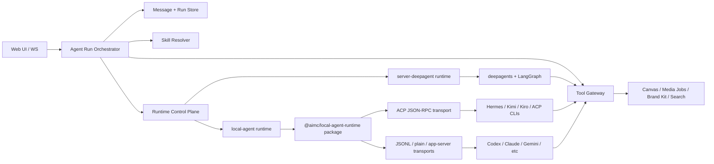

# Agent Runtime 与 Local Agent 集成方案

Date: 2026-06-03
Project: `ai-media-canvas`
Status: Draft

## 目标

`ai-media-canvas` 需要同时保留现有的服务端 deepagent 链路，并新增一种可以调用本地 agent CLI 的链路。这个方案的核心目标是让两种执行方式共享同一套产品语义：

- 同一套 chat session / message / run 展示模型
- 同一套 workspace skill 数据源
- 同一套 canvas、media、brand kit、project search 等业务工具能力
- 同一套权限、计费、审计和事件流协议

结论先行：推荐把现有 deepagent 链路抽象成 `server-deepagent` runtime adapter，再新增 `local-agent` runtime adapter。上层 run orchestration、message persistence、event normalization、tool gateway 不绑定具体 agent 实现。

## 现有链路复盘

### ai-media-canvas 当前 agent 链路

当前 AIMC 是服务端自己拥有 agent loop：

1. WebSocket 收到 `agent.run` command。
2. `ws/handler.ts` 解析用户、session、model、thread，并调用 `agentRuns.createRun()`。
3. `agent/runtime.ts` 在内存 `Map` 里创建 run，状态为 `accepted`。
4. `streamRun()` 只允许消费一次，把状态切到 `running`，初始化 LangGraph persistence。
5. runtime 加载 workspace skills、构造 deepagents backend、创建 `createAimcDeepAgent()`。
6. `buildUserMessage()` 把 prompt、canvas state、attachments、model preference、mentions 包成 XML 注入给模型。
7. `agent.streamEvents(..., { configurable: { thread_id, canvas_id, access_token, user_id, user_attachment_map } })` 驱动 deepagent。
8. `stream-adapter.ts` 把 deepagent 事件归一化成 AIMC 的 `StreamEvent`。
9. WS handler 把事件推给同 canvas viewers，同时累积 assistant text / tool blocks。
10. run 结束后，WS handler 将 assistant message 写入 chat storage。

关键代码位置：

- Run 创建与流式消费：`apps/server/src/agent/runtime.ts`
- WS 入口与 assistant message 持久化：`apps/server/src/ws/handler.ts`
- Deepagent 创建与 system prompt / tools 注入：`apps/server/src/agent/deep-agent.ts`
- 共享事件与 chat schema：`packages/shared/src/contracts.ts`

这个链路的优势是业务工具、权限、计费都在服务端闭环内，适合云端运行和强管控场景。代价是 agent loop 与 deepagents 强绑定，本地 CLI agent 很难直接复用这套入口。

### ai-media-canvas 的 skills

AIMC 的 workspace skills 已经是数据库驱动：

- `loadWorkspaceSkills()` 通过 canvas -> project -> workspace 找到 workspace。
- 查询启用的 `workspace_skills` 和对应 `skills` 内容。
- 批量加载 `skill_files`。
- 输出 `WorkspaceSkillEntry`，其中 `path` 是 `/workspace-skills/<slug>/SKILL.md`。

deepagent 链路中，runtime 会把这些 skills 写进 LangGraph store 的 `["projects", canvasId, "workspace-skills"]` namespace。`createAimcDeepAgent()` 还会把启用 skill 的名称、描述、虚拟路径、文件摘要注入 system prompt。

这说明 AIMC 的 skill 数据源已经比较适合复用。local agent 不应该另建 skill registry，而应该使用同一批 `WorkspaceSkillEntry`，只是在交付方式上不同：

- deepagent：store route + system prompt mention。
- local agent：materialize 到临时目录、项目 instruction 文件，或 prompt injection。

### ai-media-canvas 的 memory

AIMC 当前有两类 memory：

- 产品 chat memory：`chat_sessions` / `chat_messages`，用于 UI 展示和历史对话。
- Agent working memory：LangGraph `checkpointer` + `store`，用于 deepagent thread state、`/workspace/`、`/memories/`、`/workspace-skills/`。

`createAgentPersistenceService()` 在 `SUPABASE_DB_URL` 存在时创建 Supabase Postgres backed checkpointer / store。`streamRun()` 如果有 `threadId` 但没有 persistence，会直接失败。这对 deepagent 是合理的，但 local agent 不一定有 LangGraph thread state，所以需要把 memory 层分成产品层和 runtime 层。

### ai-media-canvas 的 messages

当前 message 存储更偏“最终结果”：

- 用户消息由 chat API / 前端流程创建。
- assistant message 在 WS streaming 完成后才由 `ws/handler.ts` 创建。
- streaming 期间只在内存和 event buffer 里存在，reconnect 可以通过 canvas event buffer 补一段，但 chat message 没有持久化 `runId`、`runStatus`、`lastRunEventId`。

这个模型对短 run 可以工作，但 local agent CLI 更需要可恢复 run transcript，因为 CLI 输出、工具调用、文件写入、子进程退出都可能跨较长时间发生。建议 AIMC 学 open-design，把 run 与 assistant message 建立更强的持久关系。

### ai-media-canvas 的 tools

AIMC 当前工具是 LangChain `StructuredTool`：

- `project_search`
- `inspect_canvas`
- `manipulate_canvas`
- `image_generate`
- `video_generate`
- `persist_sandbox_file`
- `get_brand_kit`
- `screenshot_canvas`

deepagents 还通过 filesystem middleware 自动注入 `ls`、`read_file`、`write_file`、`edit_file`、`grep`、`glob`、`execute`、`task`、`write_todos` 等工具。backend route 里 `/workspace/`、`/memories/` 走 store，`/skills/` 走 filesystem，default 走 local shell sandbox。

这套工具适合 deepagent 内部调用，但不适合原样给 local CLI，因为 CLI 不能直接拿 LangChain tool object，也不应该直接拿用户 access token。local agent 应该通过 run-scoped tool gateway 访问 AIMC 业务工具。

## open-design local agent 链路对比

open-design 的核心思想是：不要自己重写 agent loop，而是适配用户已经安装的本地 code agent CLI。

### Runtime adapter

OD 的 agent adapter 负责：

- detect：探测 CLI 是否安装、版本、模型列表、能力。
- buildArgs：按不同 CLI 构造启动参数。
- prompt delivery：优先 stdin，规避命令行长度限制。
- stream parser：把 JSONL、ACP JSON-RPC、plain text 等输出映射成统一事件。
- cancel / resume：按 agent 能力处理子进程或 RPC session。

`docs/agent-adapters.md` 明确把 model calls、tool use、context management、permission handling、resume、cancel 交给 CLI agent。daemon 只负责检测、喂 prompt / skill / cwd、转发输出。

### Run 与 message

OD 的 run service 是内存 run registry，但事件是可重放的：

- run 有 `projectId`、`conversationId`、`assistantMessageId`、`agentId`、`status`、`events`、`nextEventId`、`child`、`acpSession`。
- SSE stream 支持 `Last-Event-ID` 和 `after`，可以补发历史事件。
- Web 侧先创建 assistant message，把 `runId`、`runStatus`、`lastRunEventId` 写在 message 上，再不断更新 partial content 和 events。

这对 AIMC 很有参考价值：local agent 链路不应该只在 run 结束后写 assistant message，而应该让 assistant message 从 run accepted 起就是一个 durable anchor。

### Skills

OD 使用 `SKILL.md` 作为基础协议，并支持三种注入方式：

- native skill loading：放到 agent 自己的 skills 目录。
- prompt injection：把 `SKILL.md` 和必要 references 放进 prompt。
- file-placed workflow：写入 `AGENTS.md`、`.cursorrules` 等项目 instruction 文件。

AIMC 可以沿用这个策略，但 skill source 仍然来自当前 workspace skill 数据库。也就是说，AIMC 不需要复制 OD 的 skill discovery，只需要复制 skill delivery 策略。

### Tools

OD 对 local agent 的工具调用不是直接暴露内部服务，而是通过 run-scoped token：

- daemon mint `OD_TOOL_TOKEN`。
- 子进程环境里有 `OD_DAEMON_URL`、`OD_NODE_BIN`、`OD_BIN`、`OD_TOOL_TOKEN`。
- CLI agent 可以通过 wrapper command 或 MCP server 调用 daemon tool endpoints。
- token 有 TTL、allowed endpoints、allowed operations，run 结束或超时后撤销。

这是 AIMC local agent 工具设计最值得借鉴的部分。

## 方案选型

### 方案 A：在现有 `AgentRunService` 里直接塞 local CLI 分支

做法：在 `streamRun()` 中判断 run mode，如果是 local 就 spawn CLI。

优点：

- 改动入口少。
- 可以快速做 demo。

缺点：

- `runtime.ts` 已经承担 deepagent、persistence、billing job closure、skill loading、message event 适配等职责，再塞 CLI 会快速变成大文件。
- deepagent persistence 与 local CLI session state 会混在一起。
- 工具适配和事件解析会污染当前 server-agent 路径。

不推荐作为长期方案。

### 方案 B：完全替换成 open-design daemon 模式

做法：AIMC agent 全部改成本地 daemon + CLI adapter，deepagent 退为 fallback。

优点：

- local-first 体验最纯粹。
- CLI agent 能力利用最大。

缺点：

- AIMC 现有云端链路、计费、媒体生成、canvas 写入、Supabase auth 都会被冲击。
- 当前 deepagent 工具和 LangGraph memory 的投入会被浪费。
- 对 WebSocket、chat persistence、job service 的影响面过大。

不推荐。AIMC 不是纯 local IDE 产品，它有明确的云端业务工具和资产生成链路。

### 方案 C：Runtime Control Plane + Agent Backend Adapter 分层

做法：把原本单层的 runtime adapter 再拆细成两层：

- `Runtime Control Plane`：负责 runtime 注册、检测、心跳、选择、并发、cancel dispatch、runtime recovery。
- `Agent Backend Adapter`：负责 Codex / Claude / ACP runtimes 等 CLI 的启动参数、stdin prompt、stream parser、session resume、capabilities。

现有 deepagent 会成为一个 first-party `server-deepagent` runtime。local-agent 的 CLI/ACP 执行层抽成可复用 package，AIMC 只在应用层绑定 canvas/media/tool 权限。

优点：

- 保留 AIMC 当前生产能力。
- local agent 能以独立 adapter 接入，方便先支持 Codex / Claude Code，再逐步扩展。
- ACP / CLI local-agent 能沉淀成 package，后续其他应用可以复用本地 agent 执行层。
- skills、messages、tools 可以统一在 adapter 外层设计，减少分叉。
- 可以灰度：workspace / user / session 级选择 runtime。

缺点：

- 初始抽象工作比方案 A 多。
- 需要补 run event persistence，否则 local-agent 体验会弱。

推荐方案 C，并将 local-agent 执行层包化。

## 推荐架构



### 1. Agent Run Orchestrator 与 Runtime Control Plane

新增一个上层 orchestrator，负责 run 生命周期，不关心底层是 deepagent 还是 local CLI。orchestrator 下面再放 `Runtime Control Plane`，专门管理 runtime 的可用性和执行资源。

建议接口：

```ts
type AgentRuntimeKind = "server-deepagent" | "local-agent";

type AgentRuntimeRecord = {
  id: string;
  kind: AgentRuntimeKind;
  provider: "deepagent" | "codex" | "claude" | "hermes" | "kimi" | "kiro" | string;
  mode: "server" | "local";
  status: "online" | "offline" | "degraded";
  capabilities: AgentRuntimeCapabilities;
  lastSeenAt?: string;
};

type AgentRuntimeAdapter = {
  runtime: AgentRuntimeRecord;
  capabilities(): AgentRuntimeCapabilities;
  prepare?(context: AgentRunContext): Promise<PreparedAgentRun>;
  run(context: AgentRunContext): AsyncIterable<StreamEvent>;
  cancel(runId: string): Promise<void>;
};
```

orchestrator 负责：

- 创建 run record。
- 创建或更新 assistant message anchor。
- 解析 thread、model、runtime selection。
- 加载 skills。
- 创建 tool grant。
- 调用 runtime control plane 选择 runtime。
- 调用对应 backend adapter。
- 归一化 stream event。
- 持久化 run events、message content blocks、run status。
- cancel / reconnect / replay。

现有 `createAgentRunService()` 可以逐步改造成 orchestrator。第一阶段不需要大重写，可以先把 deepagent 核心逻辑提取到 `server-deepagent-adapter.ts`，保留现有 API。

control plane 负责：

- local runtime detect：env override -> PATH -> login shell fallback -> app bundle fallback -> version/min-version -> model list。
- runtime health：local trusted mode 下注册 provider/runtime 状态，记录 `lastSeenAt`。
- concurrency：每个 runtime 的 max concurrent runs，避免多个长任务同时抢同一 CLI / workspace。
- recovery：子进程异常退出、runtime offline、cancel 后 token revoke、sandbox cleanup。
- selection：根据 run request、workspace 默认值、runtime capability、在线状态选择可用 runtime。

职责边界要写死，避免重新制造一个更大的 `runtime.ts`：

- `Agent Run Orchestrator` 是产品状态 owner。它负责 run 状态机、assistant message anchor、event 持久化、replay、上下文组装、skill delivery 调用和 tool grant 创建。
- `Runtime Control Plane` 不拥有产品状态。它只负责 runtime registry、health、capabilities、selection、concurrency、cancel dispatch 和 recovery signal。
- `Agent Backend Adapter` 不写 DB、不执行业务工具。它只把 `PreparedAgentRun` 交给 deepagent / CLI / ACP，并把底层输出归一化为 `AgentEvent`。
- `Tool Gateway` 是业务工具唯一执行入口。deepagent 和 local-agent 都不能绕过 gateway 直接写 canvas、media、brand kit 或 project search。

run 状态命名也需要统一。建议产品层统一使用 `accepted -> running -> completed | failed | canceled`，因为当前 shared event 已经使用 `run.canceled`，不要在 package 或 DB 里混用 `cancelled`。

### 2. Runtime selection

建议运行时选择优先级：

1. Run request 显式指定 `runtimeKind`。
2. Session / workspace 设置里的默认 runtime。
3. 服务端环境默认值。
4. fallback 到 `server-deepagent`。

local-agent 只应该在本地 daemon / desktop / trusted local server 模式可用。云端部署不应该 spawn 用户机器上的 CLI，也不应该假设存在本地 toolchain。

### 3. Event contract

当前 `StreamEvent` 已经有 `run.started`、`message.delta`、`thinking.delta`、`tool.started`、`tool.completed`、`canvas.sync`、`run.completed`、`run.failed`。建议扩展而不是替换：

- 增加 `run.queued` 或继续使用 `accepted` response。
- 增加 `run.event` persistent id：`eventId` 或 `seq`。
- 增加 `tool.failed`，避免失败工具只能伪装成 `tool.completed`。
- 增加 `artifact.created` / `file.changed` 可选事件，local CLI 文件产物需要表达。
- 增加 `run.adapter.status` 可选事件，用于 CLI detect、spawn、stderr warning。

UI 可以继续按现有事件展示；新字段用于 replay 和 local-agent richer output。

### 4. Message 与 run 存储

建议把 assistant message 从“结束后创建”改成“run 创建时创建，过程中更新”。

新增或扩展字段：

- `chat_messages.run_id`
- `chat_messages.run_status`
- `chat_messages.last_run_event_id`
- `chat_messages.events_json`
- `chat_messages.produced_artifacts_json`
- `agent_run_events(run_id, event_id, type, payload, created_at)`

如果短期不想扩 DB 表，至少先在现有 local sqlite / Supabase metadata 里存：

- run status
- last event id
- assistant content blocks snapshot
- terminal error

推荐最终有独立 `agent_run_events`，因为 local CLI 的重连和审计价值更高。

### 5. Skills 设计

保留当前 workspace skill 数据源，新增 `SkillDeliveryService`：

```ts
type SkillDeliveryMode =
  | "deepagent-store"
  | "materialized-files"
  | "prompt-injection"
  | "project-instructions";

type PreparedSkills = {
  promptSummary: string;
  materializedDir?: string;
  extraAllowedDirs: string[];
  cleanup(): Promise<void>;
};
```

deepagent adapter：

- 沿用 `/workspace-skills/<slug>/SKILL.md`。
- 将 skill content 和 files 写入 store namespace。
- system prompt 注入 skill list 和 read path。

local-agent adapter：

- 把 `WorkspaceSkillEntry` materialize 到 per-run sandbox，例如 `.aimc-runs/<runId>/skills/<slug>/SKILL.md`。
- 对支持 native skills 的 CLI，可以 symlink 或 copy 到 agent 可读目录，但第一阶段建议只用 per-run materialize，避免污染用户全局目录。
- prompt 中加入 skill index、selected skills、读取路径。
- 对不支持读外部目录的 CLI，把关键 `SKILL.md` 走 prompt injection，files 仍放到 cwd。

需要同步修正一个现有 schema gap：`runtime.ts` 已经处理 `mentionType: "skill"`，但 `packages/shared/src/contracts.ts` 的 `messageMentionSchema` 还没有 skill mention 分支。这个会影响 skill mention 从客户端合法进入 run request。

### 6. Memory 设计

把 memory 明确拆成四层：

| 层级 | 用途 | deepagent | local-agent |
|---|---|---|---|
| Chat history | UI 对话历史 | `chat_messages` | `chat_messages` |
| Run transcript | replay / audit / recovery | `agent_run_events` | `agent_run_events` |
| Agent working memory | agent 内部状态 | LangGraph checkpointer/store | adapter-specific session id / local transcript |
| Workspace memory | 项目文件、skills、长期记忆 | `/workspace/` `/memories/` store | materialized cwd + optional store bridge |

local-agent 不应该强行接入 LangGraph checkpointer。更合理的是：

- 对 CLI 原生 resume 能力，保存 CLI session id 或 adapter resume token。
- 对无 resume 能力的 CLI，保存 compacted conversation summary + recent messages，下一轮重新 prompt。
- 对长期项目记忆，提供 `aimc_memory_read` / `aimc_memory_write` tool gateway，映射到 AIMC store。

### 7. Tools 设计

把 AIMC 工具拆成两个形态：

- `ToolDefinition`：业务工具的统一 schema、权限、执行函数。
- `ToolBinding`：某个 runtime 下如何暴露工具。

建议先定义内部 tool registry：

```ts
type AimcToolDefinition = {
  name: string;
  description: string;
  inputSchema: unknown;
  permission: "read" | "write" | "media-job" | "canvas-write";
  execute(ctx: ToolExecutionContext, input: unknown): Promise<ToolResult>;
};
```

deepagent binding：

- 将 `AimcToolDefinition` 包装成 LangChain `StructuredTool`。
- 继续复用现有 `createMainAgentTools()` 的实现。

local-agent binding：

- mint run-scoped `AIMC_TOOL_TOKEN`。
- 子进程环境提供 `AIMC_DAEMON_URL`、`AIMC_TOOL_TOKEN`、`AIMC_RUN_ID`、`AIMC_CANVAS_ID`。
- 暴露 HTTP endpoints：`/api/agent-tools/<toolName>`。
- 可选提供 MCP server：`aimc-tools-mcp`，给支持 MCP 的 CLI 使用。
- tool token 限定 runId、canvasId、userId、allowedTools、expiresAt。
- run terminal 后撤销 token。

第一阶段 local-agent tool set 不需要一次支持所有工具。建议 P0 支持：

- `inspect_canvas`
- `manipulate_canvas`
- `image_generate`
- `video_generate`
- `project_search`

`screenshot_canvas` 依赖前端连接和 RPC，可以作为 P1。

### 8. 可复用 local-agent-runtime package

local-agent 执行层应该抽成独立 workspace package，建议命名为：

```text
packages/local-agent-runtime
```

这个 package 的目标是给 AIMC 和后续其他应用复用本地 agent 执行能力。它只处理“如何驱动本地 agent CLI”，不处理 AIMC 业务权限。

package 应包含：

- CLI detection：可执行文件解析、版本检测、最低版本校验、模型列表探测。
- process runtime：spawn、stdin prompt、stdout/stderr parser、timeout、cancel、stderr tail。
- transports：`acp-json-rpc`、`jsonl`、`plain`、`codex-app-server`。
- adapters：`codex`、`claude`、`generic-acp`，后续扩展 `hermes`、`kimi`、`kiro`、`gemini`。
- event normalization：输出统一 `AgentEvent`。
- skill helpers：materialize skills、prompt injection、provider-aware skill dir。
- MCP helpers：把应用传入的 MCP config 转成 ACP `mcpServers` 或 CLI 原生 config。

package 不应包含：

- AIMC canvas 操作。
- media job / credits / tier guard。
- Supabase auth / workspace permission。
- chat message / run event DB 写入。
- `AIMC_TOOL_TOKEN` 签发与校验。

这些必须留在 AIMC 应用层，因为它们是业务边界。

建议 package API：

```ts
export type LocalAgentRuntime = {
  detect(): Promise<AgentDetection>;
  listModels?(): Promise<AgentModel[]>;
  run(input: AgentRunInput): AsyncIterable<AgentEvent>;
  cancel(runId: string): Promise<void>;
};

export type AgentRunInput = {
  runId: string;
  cwd: string;
  prompt: string;
  systemPrompt?: string;
  model?: string;
  env?: Record<string, string>;
  mcpServers?: AcpMcpServer[];
  timeoutMs?: number;
  resumeSessionId?: string;
};

export type AgentEvent =
  | { type: "status"; status: "initializing" | "running" | "completed" }
  | { type: "text_delta"; text: string }
  | { type: "thinking_delta"; text: string }
  | { type: "tool_call"; id: string; name: string; input?: unknown }
  | { type: "tool_result"; id: string; status: "completed" | "failed"; output?: unknown; error?: string }
  | { type: "usage"; usage: unknown }
  | { type: "error"; message: string }
  | { type: "done"; status: "completed" | "failed" | "canceled"; sessionId?: string };
```

如果目标是后续可对外发包，不建议把 detection、transport、process lifecycle、provider parser、permission policy 全部压进一个 `LocalAgentRuntime` 大接口。更稳的 public contracts 是：

```ts
export interface LocalAgentProviderPlugin {
  id: string;
  displayName: string;
  supportedTransports: TransportKind[];
  detect(ctx: DetectContext): Promise<DetectionResult>;
  createAdapter(ctx: ProviderInitContext): ProviderAdapter;
}

export interface ProviderAdapter {
  buildLaunchPlan(input: AgentRunInput): Promise<LaunchPlan>;
  parseEvents(stream: RawAgentStream): AsyncIterable<AgentEvent>;
  capabilities(): AgentRuntimeCapabilities;
}

export interface Transport {
  kind: TransportKind;
  run(plan: LaunchPlan, signal: AbortSignal): AsyncIterable<RawAgentEvent>;
}
```

对外 package 建议拆分：

- `@aimc/local-agent-core`：contracts、event、errors、capabilities、registry、skill/MCP types。
- `@aimc/local-agent-process`：spawn supervisor、cancel、timeout、stderr tail。
- `@aimc/local-agent-transport-acp`：ACP JSON-RPC transport。
- `@aimc/local-agent-adapter-codex`：Codex adapter。
- `@aimc/local-agent-adapter-claude`：Claude adapter。
- `@aimc/local-agent-runtime`：convenience bundle，重导 core 和官方 adapters，供 AIMC 内部优先使用。

这样 provider plugin 只处理“这个 CLI 怎么启动、怎么读输出、有什么能力”，宿主应用只处理“这个 run 允许调用哪些业务工具”。ACP 类 provider 可以共享 `@aimc/local-agent-transport-acp`，只覆盖 command、model mapping、permission mapping 和 provider-specific normalization。

package 的 error taxonomy 也需要成为 public contract：

- `detection_failed`
- `unsupported_version`
- `spawn_failed`
- `protocol_error`
- `permission_denied`
- `tool_error`
- `timeout`
- `canceled`
- `provider_auth_required`
- `provider_rate_limited`
- `unknown_provider_error`

### 9. ACP Transport 设计

ACP 不应该散落在 AIMC server runtime 里。它应作为 `packages/local-agent-runtime` 里的一个 transport：

```ts
export type AcpClient = {
  initialize(input: AcpInitializeInput): Promise<AcpInitializeResult>;
  newSession(input: AcpSessionInput): Promise<AcpSessionResult>;
  resumeSession?(sessionId: string): Promise<AcpSessionResult>;
  setModel?(model: string): Promise<void>;
  prompt(input: AcpPromptInput): AsyncIterable<AgentEvent>;
  abort(): Promise<void>;
};
```

ACP transport 负责：

- 启动 `hermes acp`、`kimi acp`、`kiro-cli acp`、`copilot --acp` 这类进程。
- 通过 stdio 驱动 JSON-RPC：`initialize`、`session/new`、可选 `session/resume`、可选 `session/set_model`、`session/prompt`。
- 解析 `session/update`，映射为通用 `AgentEvent`。
- 处理 `session/request_permission`，在 headless 模式下按策略 approve / deny。
- 从 `session/new` 读取 `sessionId`、`availableModels`、`currentModelId`。
- 转换 MCP config 到 ACP `mcpServers`。
- 处理 stage timeout、fatal JSON-RPC error、stderr provider error sniffing。

AIMC 应用层只接收通用 `AgentEvent`，再转换成 AIMC `StreamEvent`：

```text
AgentEvent.text_delta -> StreamEvent.message.delta
AgentEvent.thinking_delta -> StreamEvent.thinking.delta
AgentEvent.tool_call -> StreamEvent.tool.started
AgentEvent.tool_result -> StreamEvent.tool.completed / tool.failed
AgentEvent.done -> run.completed / run.failed / run.canceled
```

### 10. Local Agent Adapter

local-agent adapter 参考 OD，但 AIMC 不需要一开始支持大量 CLI。建议 P0：

- fake adapter
- `codex`

基础能力：

- detect installed CLI。
- 读取版本。
- 提供 fallback model list。
- build args。
- prompt via stdin。
- spawn cwd 指向 per-run sandbox。
- parse stream-json / json / plain output。
- stderr warning 映射成 adapter status event。
- cancel 时 kill child process。

per-run sandbox 建议包含：

```text
.aimc-runs/<runId>/
  PROMPT.md
  skills/
  attachments/
  workspace/
  outputs/
```

prompt 里明确告诉 local CLI：

- 当前任务是操作 AIMC canvas，不是随意修改仓库。
- 业务工具通过 AIMC wrapper / MCP 调用。
- 不要打印 token。
- 输出最终回答即可，canvas 修改通过工具完成。

真实 Claude / ACP runtimes 建议作为 P1。原因是 fake adapter + Codex 可以先验证 package API、message/run persistence、tool gateway、sandbox cleanup 等关键边界；真实 CLI 差异不要过早掩盖架构问题。

### 11. Security 与权限

local-agent 最大风险是它能执行用户本地 CLI，不能把云端服务端 token 和内部工具裸露出去。

必须做：

- local-agent runtime 只在本地 trusted mode 开启。
- tool token run-scoped、短 TTL、可撤销。
- token 绑定 userId、canvasId、runId、allowedTools。
- tool gateway 重新做服务端权限校验，不相信 CLI 输入。
- media generation 仍走现有 job service 和 tier guard。
- canvas write 仍走现有 `manipulate_canvas` / canvas writer，不允许 CLI 直接写数据库。
- sandbox cwd 与产物目录隔离。
- 不把 Supabase access token 放进 CLI env。

### 12. 渐进式落地步骤

Phase 1：抽 package 与 fake adapter

- 新增 `packages/local-agent-runtime`。
- 定义 `LocalAgentRuntime`、`AgentRunInput`、`AgentEvent`。
- 实现 fake adapter，用 fixture stdout/stderr 验证事件转换。
- AIMC server 侧新增 local-runtime binding，把 `AgentEvent` 映射成 `StreamEvent`。
- 不接真实 CLI，先保证 API 边界稳定。

Phase 2：Runtime Control Plane + deepagent adapter

- 增加 `AgentRuntimeRecord` / runtime selection。
- 将现有 deepagent 链路包成 `server-deepagent` runtime。
- run request 增加可选 `runtimeKind`，默认仍是 deepagent。
- 不改变 UI 行为。

Phase 3：增强 run/message 持久化

- assistant message 在 run accepted 时创建。
- message 存 `runId`、`runStatus`、`lastRunEventId`。
- 增加 run event persistence 或最小 snapshot。
- WS reconnect 使用 event id replay。

Phase 4：Tool registry 与 gateway

- 抽出 AIMC business tool definitions。
- deepagent 通过 LangChain binding 使用。
- local-agent 通过 HTTP/MCP binding 使用。
- 增加 run-scoped tool token。
- 优先 HTTP wrapper，MCP binding 作为 P1。

Phase 5：Codex local adapter P0

- 支持 Codex CLI。
- 优先使用 stdin / JSONL 或 app-server transport，按当前可用 CLI 能力选择。
- materialize skills / attachments / prompt。
- parse text delta、tool start/end、error、done。
- cancel child process。

Phase 6：ACP 与能力扩展

- 增加 ACP transport。
- 支持 Hermes / Kimi / Kiro 等 ACP runtimes。
- 支持 Claude Code。
- adapter detection UI。
- CLI model picker。
- screenshot canvas。
- native skill loading。
- CLI resume。
- 更多 agent：Gemini、OpenCode、Qoder。

## 测试策略

local-agent / ACP / deepagent 双 runtime 的测试目标不是只验证 CLI 能启动，而是锁定 AIMC 的产品语义不随 runtime 分叉。P0 必须先建立 shared contract、fake adapter、tool gateway security、run event persistence、skill isolation 五类测试，再接入真实 Codex 或 ACP provider。

推荐测试矩阵：

| 面向 | 必测内容 |
|---|---|
| Shared contracts | `runtimeKind`、`skill` mention、`run.canceled`、`tool.failed`、failed tool block、adapter status event |
| Run state machine | `accepted -> running -> completed/failed/canceled`，非法转移拒绝，terminal 后不能继续写 event |
| Durable message anchor | run accepted 时创建 assistant message，过程中更新 `runStatus`、`lastRunEventId`、content snapshot |
| Fake adapter | success、tool failed、permission denied、long-running cancel、malformed output、stderr warning、secret leakage、partial chunks、non-zero exit |
| Event replay | deterministic `eventId/seq`、`Last-Event-ID` 补发、重复连接不重复落库、server restart 后从 persistent events 恢复 |
| ACP transport | fake ACP peer 覆盖 `initialize`、`session/new`、`session/prompt`、`session/update`、`session/request_permission`、timeout、fatal JSON-RPC error、invalid JSON、child exit |
| Tool gateway | token 绑定 `runId/userId/canvasId/allowedTools`、TTL fake clock、allowlist、revoke、wrong canvas/user、schema validation、permission recheck |
| Skills isolation | per-run sandbox、slug/path sanitize、symlink escape reject、cleanup、per-run `CODEX_HOME`、不写 `~/.codex` 或项目根 `AGENTS.md` |
| 双 runtime 回归 | 同一 run request 在 deepagent/local fake 下产生兼容 UI 事件，默认仍走 deepagent，local-agent 只在 trusted local mode 可选 |

P0 测试顺序：

1. 先补 shared contract tests，锁定 `runtimeKind`、`skill` mention、`tool.failed`、`run.canceled`。
2. 再补 run/message persistence tests，验证 accepted 时创建 anchor、event append、snapshot update、terminal idempotency。
3. 再补 fake adapter conformance tests，用 fixture 覆盖 success/fail/cancel/reconnect/secret leakage。
4. 再补 tool gateway security tests，覆盖 TTL、allowlist、wrong run/canvas/user、terminal revoke、stdout/stderr 脱敏。
5. 再补 skill isolation tests，证明 per-run materialize / `CODEX_HOME` 不污染用户全局环境。
6. 最后才接真实 Codex smoke test 和 ACP fake peer contract test。

fake adapter 是 P0 的 conformance runtime，不应只是固定输出文本。它要能断言 stdin prompt、cwd、env、per-run skills、tool token，并按 fixture 模拟 stdout/stderr、JSONL、tool success、tool failed、permission denied、long-running cancel、malformed output 和 non-zero exit。

ACP transport 要有独立 fake ACP peer，测试 JSON-RPC method order、request id correlation、stage timeout、permission approve/deny、stderr provider error sniffing，以及 `session/update` 到 `AgentEvent` 的映射。

Tool gateway 测试必须证明 local CLI 永远不能凭输入绕过服务端权限。每个 endpoint 都要重新校验 user、run、canvas、allowed tool 和业务权限；permission denied 不应该产生 canvas side effect。

## open-design / multica 对齐评估

open-design 的精髓不是某个具体 CLI adapter，而是“宿主不拥有 agent loop”。它把 model call、tool use、context management、permission handling 尽量交给本地 agent CLI，daemon 负责 detect、prompt / skill delivery、stream normalization、run replay 和 run-scoped tool token。AIMC 应吸收这些点，但不能照搬 OD 的全局 skill registry 和纯本地文件工作区，因为 AIMC 的 skill source、media job、canvas write、credits 和 workspace permission 都是服务端业务边界。

AIMC 已经吸收 OD 的关键点：

- adapter abstraction：不同 CLI / ACP provider 只在 backend adapter 层差异化。
- event replay：从内存 ring buffer 升级为 durable `agent_run_events`。
- tool token：local-agent 只拿 run-scoped tool grant，不拿 Supabase token。
- skill delivery：workspace DB 是唯一 source，delivery 才 provider-aware。
- ACP：作为 transport，而不是应用业务层协议。

还需要补的 OD 要点：

- `assistantMessageId` / message anchor 必须 run accepted 时前置创建。
- token grant 必须有 TTL、allowed endpoints / operations、revoke reason 和 terminal revoke。
- skill side files 应优先 stage 到 run cwd 下的相对路径，prompt 中告诉 agent 读取相对路径，减少绝对路径和全局目录依赖。
- ACP / plain / JSONL parser 都要有 fixture tests，unknown event 不能破坏主链路。

multica 的精髓是“server control plane + local daemon runtime”。daemon 注册 runtime，runtime 带 type / version / status，heartbeat 更新 `lastSeen` 并拉取 pending actions；任务通过 queue claim，而不是仅靠 WebSocket push；agent backend 只负责具体 Codex / Claude / Hermes 执行。这个思路适合 AIMC 用来生产化 local-agent runtime health、concurrency、task claim、runtime gone / re-register 和 recovery。

AIMC 应吸收 multica 的点：

- `agent_runtime` 是一等资源，不是 `streamRun()` 分支。
- runtime 注册、heartbeat、lastSeen、capabilities、runtime gone / re-register 要进入 control plane。
- claim / lease / concurrency 可用于防止同一 local runtime 同时执行多个长 run。
- model list、local skills import、CLI update 这类 pending action 可以通过 heartbeat 返回。

不应照搬 multica 的点：

- 不要把 AIMC 实时 canvas chat 改成完整 task queue 产品，否则会牺牲当前 WS 实时体验。
- 不要让 daemon 直接拥有 AIMC business tool execution；工具仍必须回到 AIMC Tool Gateway。
- 不要把 issue / task / squad 语义带入 AIMC。AIMC 只需要 runtime control plane 的运行时管理经验。

ACP 在这个设计里的边界应保持清晰：ACP 是 `@aimc/local-agent-transport-acp` 的 transport protocol，负责 JSON-RPC lifecycle、session、permission request、MCP config shape 和 provider event normalization；它不拥有 run DB、message DB、tool permission、workspace skill source 或 canvas/media 业务。

## 当前方案需要补强的点

这轮方案评审后，需要把以下点作为 v2 设计的硬约束，而不是实现时再补：

1. `local-agent` 不应只是 `streamRun()` 的一个分支。需要引入 `agent_runtime` 概念，记录 `provider`、`device`、`status`、`lastSeen`、`capabilities`、`runtimeMode`。
2. Message/run 存储要前置。run accepted 时就创建 assistant message anchor，保存 `runId`、`runStatus`、`lastEventId`，并落 `agent_run_events`。
3. P0 顺序应调整。先做 fake adapter + durable run/message + tool token gateway，再接真实 Codex / Claude。
4. Skills 仍以 AIMC workspace DB 作为唯一数据源，但 delivery 要补 provider-aware 策略：per-run materialize、Codex per-run `CODEX_HOME`、必要时 prompt injection，避免污染用户全局 skills。
5. Tool schema 要抽统一 `AimcToolDefinition`。deepagent binding 包成 LangChain tool，local-agent binding 包成 HTTP/MCP gateway。
6. 要补 `skill` mention schema gap。runtime 已处理 `mentionType: "skill"`，但 shared contracts 目前不允许。
7. 要补 `tool.failed` 或 tool block `failed` 状态。否则 local gateway 失败无法被清晰表达。
8. 安全章节要更硬：不传 Supabase token、token TTL/allowlist/revoke、stdout/stderr 脱敏、sandbox 清理、并发限制、只在 trusted local mode 开启。
9. `Runtime Control Plane` 不应写 message/run/event DB。产品状态归 `Agent Run Orchestrator`，control plane 只管 runtime registry、health、selection、concurrency 和 recovery。
10. local-agent package 要按 public contracts 设计，不要只有一个大 `LocalAgentRuntime`。至少要拆 `ProviderAdapter`、`Transport`、`ProcessSupervisor`、`SkillDelivery`、`PermissionPolicy`、`CapabilityModel` 和 error taxonomy。
11. 对外发包建议拆 `core + process + transport-acp + provider adapters + runtime bundle`，避免 Codex/Claude/ACP/Hermes/Kimi/Kiro 差异污染 core。
12. 测试必须先覆盖 fake adapter、durable event replay、tool gateway security、ACP fake peer、skills isolation，再接真实 Codex/Claude/ACP provider。

## 是否有更优替代方案

目前没有看到比“双 runtime + control plane + backend adapter”更合适的整体方案。

完全走 open-design 会丢掉 AIMC 的服务端 deepagent、媒体生成和计费闭环；完全走 multica task queue 会把 AIMC 的实时 canvas chat 复杂化。更优路径是：AIMC 保留当前 deepagent 作为 first-party server runtime，同时为 local-agent 增加一个更生产化的 runtime control plane。

因此方案文档 v2 应把原来的 `Runtime Adapter` 章节拆成 `Runtime Control Plane` 和 `Agent Backend Adapter`，并把 multica 的 runtime 注册、heartbeat、task claim、并发控制、runtime recovery 经验纳入 local-agent 生产化设计。

## 主要风险

1. Local CLI 权限不可控

缓解：只在 local trusted mode 开启，cwd sandbox，工具 token 最小权限，不传 Supabase token。

2. Tool schema 双维护

缓解：先抽统一 `AimcToolDefinition`，deepagent 和 local-agent 都从它生成 binding。

3. Message 存储改造影响 UI

缓解：先兼容现有结束后写入逻辑，再灰度启用 assistant message anchor。

4. Skill mention schema gap

缓解：补 `skill` mention schema，并加契约测试覆盖 runtime 已支持但 shared schema 不允许的问题。

5. CLI streaming 格式变化

缓解：adapter parser fixture 测试，unknown event 透传为 adapter status，首期只支持少量 CLI。

## 最小可行设计

MVP 不追求“所有 local agents 都能完美工作”，而是验证 AIMC 的双 runtime 模型：

- `server-deepagent` 完全保留当前能力。
- `local-agent` 先用 fake adapter + Codex adapter。
- skills 来自同一 workspace skill 数据源。
- tools 先支持 canvas inspect / manipulate / image_generate。
- messages 先支持 run anchor + event id snapshot。
- UI 只需要在开发入口或设置里选择 runtime。

这条路径的好处是每一步都有清晰回滚点：如果 local-agent adapter 不稳定，不影响 deepagent 默认生产链路；如果 message anchor 改造有风险，也可以先只对 local-agent runtime 开启。

## 最终建议

采用方案 C：Runtime Control Plane + Agent Backend Adapter 分层，并将 local-agent 执行层抽成 `packages/local-agent-runtime`。

AIMC 不是要变成 open-design 或 multica，也不应该丢掉现有 deepagent、media job、canvas tool 和云端权限体系。更稳的方向是吸收 OD 的 adapter、event replay、skill delivery、tool token 思路，再吸收 multica 的 runtime 注册、心跳、并发和恢复经验，把这些能力放到 AIMC 现有服务端业务边界之内。

最终形态应该是：

- deepagent 是一个 first-party server runtime。
- local-agent 是一个 trusted local runtime。
- `packages/local-agent-runtime` 负责 ACP / CLI 执行、事件归一化、model detection、cancel、resume，不包含 AIMC 业务权限。
- skills 是 workspace-owned capability，不属于某个 runtime。
- memory 被拆成 chat history、run transcript、agent working memory、workspace memory。
- tools 是业务能力定义，由不同 runtime 选择不同 binding。
- messages 与 run events 成为可恢复、可审计的产品记录。
