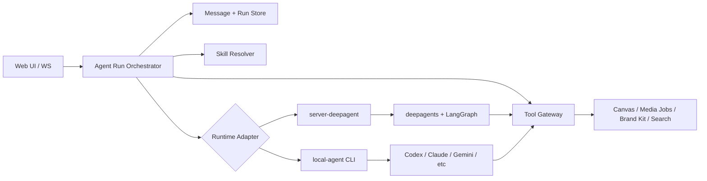

# Agent Runtime 与 Local Agent 集成方案

Date: 2026-06-03
Project: `ai-media-canvas`
Status: Draft

## 目标

`ai-media-canvas` 需要同时保留现有的服务端 deepagent 链路，并新增一种可以调用本地 agent CLI 的链路。这个方案的核心目标是让两种执行方式共享同一套产品语义：

- 同一套 chat session / message / run 展示模型
- 同一套 workspace skill 数据源
- 同一套 canvas、media、brand kit、project search 等业务工具能力
- 同一套权限、计费、审计和事件流协议

结论先行：推荐把现有 deepagent 链路抽象成 `server-deepagent` runtime adapter，再新增 `local-agent` runtime adapter。上层 run orchestration、message persistence、event normalization、tool gateway 不绑定具体 agent 实现。

## 现有链路复盘

### ai-media-canvas 当前 agent 链路

当前 AIMC 是服务端自己拥有 agent loop：

1. WebSocket 收到 `agent.run` command。
2. `ws/handler.ts` 解析用户、session、model、thread，并调用 `agentRuns.createRun()`。
3. `agent/runtime.ts` 在内存 `Map` 里创建 run，状态为 `accepted`。
4. `streamRun()` 只允许消费一次，把状态切到 `running`，初始化 LangGraph persistence。
5. runtime 加载 workspace skills、构造 deepagents backend、创建 `createAimcDeepAgent()`。
6. `buildUserMessage()` 把 prompt、canvas state、attachments、model preference、mentions 包成 XML 注入给模型。
7. `agent.streamEvents(..., { configurable: { thread_id, canvas_id, access_token, user_id, user_attachment_map } })` 驱动 deepagent。
8. `stream-adapter.ts` 把 deepagent 事件归一化成 AIMC 的 `StreamEvent`。
9. WS handler 把事件推给同 canvas viewers，同时累积 assistant text / tool blocks。
10. run 结束后，WS handler 将 assistant message 写入 chat storage。

关键代码位置：

- Run 创建与流式消费：`apps/server/src/agent/runtime.ts`
- WS 入口与 assistant message 持久化：`apps/server/src/ws/handler.ts`
- Deepagent 创建与 system prompt / tools 注入：`apps/server/src/agent/deep-agent.ts`
- 共享事件与 chat schema：`packages/shared/src/contracts.ts`

这个链路的优势是业务工具、权限、计费都在服务端闭环内，适合云端运行和强管控场景。代价是 agent loop 与 deepagents 强绑定，本地 CLI agent 很难直接复用这套入口。

### ai-media-canvas 的 skills

AIMC 的 workspace skills 已经是数据库驱动：

- `loadWorkspaceSkills()` 通过 canvas -> project -> workspace 找到 workspace。
- 查询启用的 `workspace_skills` 和对应 `skills` 内容。
- 批量加载 `skill_files`。
- 输出 `WorkspaceSkillEntry`，其中 `path` 是 `/workspace-skills/<slug>/SKILL.md`。

deepagent 链路中，runtime 会把这些 skills 写进 LangGraph store 的 `["projects", canvasId, "workspace-skills"]` namespace。`createAimcDeepAgent()` 还会把启用 skill 的名称、描述、虚拟路径、文件摘要注入 system prompt。

这说明 AIMC 的 skill 数据源已经比较适合复用。local agent 不应该另建 skill registry，而应该使用同一批 `WorkspaceSkillEntry`，只是在交付方式上不同：

- deepagent：store route + system prompt mention。
- local agent：materialize 到临时目录、项目 instruction 文件，或 prompt injection。

### ai-media-canvas 的 memory

AIMC 当前有两类 memory：

- 产品 chat memory：`chat_sessions` / `chat_messages`，用于 UI 展示和历史对话。
- Agent working memory：LangGraph `checkpointer` + `store`，用于 deepagent thread state、`/workspace/`、`/memories/`、`/workspace-skills/`。

`createAgentPersistenceService()` 在 `SUPABASE_DB_URL` 存在时创建 Supabase Postgres backed checkpointer / store。`streamRun()` 如果有 `threadId` 但没有 persistence，会直接失败。这对 deepagent 是合理的，但 local agent 不一定有 LangGraph thread state，所以需要把 memory 层分成产品层和 runtime 层。

### ai-media-canvas 的 messages

当前 message 存储更偏“最终结果”：

- 用户消息由 chat API / 前端流程创建。
- assistant message 在 WS streaming 完成后才由 `ws/handler.ts` 创建。
- streaming 期间只在内存和 event buffer 里存在，reconnect 可以通过 canvas event buffer 补一段，但 chat message 没有持久化 `runId`、`runStatus`、`lastRunEventId`。

这个模型对短 run 可以工作，但 local agent CLI 更需要可恢复 run transcript，因为 CLI 输出、工具调用、文件写入、子进程退出都可能跨较长时间发生。建议 AIMC 学 open-design，把 run 与 assistant message 建立更强的持久关系。

### ai-media-canvas 的 tools

AIMC 当前工具是 LangChain `StructuredTool`：

- `project_search`
- `inspect_canvas`
- `manipulate_canvas`
- `image_generate`
- `video_generate`
- `persist_sandbox_file`
- `get_brand_kit`
- `screenshot_canvas`

deepagents 还通过 filesystem middleware 自动注入 `ls`、`read_file`、`write_file`、`edit_file`、`grep`、`glob`、`execute`、`task`、`write_todos` 等工具。backend route 里 `/workspace/`、`/memories/` 走 store，`/skills/` 走 filesystem，default 走 local shell sandbox。

这套工具适合 deepagent 内部调用，但不适合原样给 local CLI，因为 CLI 不能直接拿 LangChain tool object，也不应该直接拿用户 access token。local agent 应该通过 run-scoped tool gateway 访问 AIMC 业务工具。

## open-design local agent 链路对比

open-design 的核心思想是：不要自己重写 agent loop，而是适配用户已经安装的本地 code agent CLI。

### Runtime adapter

OD 的 agent adapter 负责：

- detect：探测 CLI 是否安装、版本、模型列表、能力。
- buildArgs：按不同 CLI 构造启动参数。
- prompt delivery：优先 stdin，规避命令行长度限制。
- stream parser：把 JSONL、ACP JSON-RPC、plain text 等输出映射成统一事件。
- cancel / resume：按 agent 能力处理子进程或 RPC session。

`docs/agent-adapters.md` 明确把 model calls、tool use、context management、permission handling、resume、cancel 交给 CLI agent。daemon 只负责检测、喂 prompt / skill / cwd、转发输出。

### Run 与 message

OD 的 run service 是内存 run registry，但事件是可重放的：

- run 有 `projectId`、`conversationId`、`assistantMessageId`、`agentId`、`status`、`events`、`nextEventId`、`child`、`acpSession`。
- SSE stream 支持 `Last-Event-ID` 和 `after`，可以补发历史事件。
- Web 侧先创建 assistant message，把 `runId`、`runStatus`、`lastRunEventId` 写在 message 上，再不断更新 partial content 和 events。

这对 AIMC 很有参考价值：local agent 链路不应该只在 run 结束后写 assistant message，而应该让 assistant message 从 run accepted 起就是一个 durable anchor。

### Skills

OD 使用 `SKILL.md` 作为基础协议，并支持三种注入方式：

- native skill loading：放到 agent 自己的 skills 目录。
- prompt injection：把 `SKILL.md` 和必要 references 放进 prompt。
- file-placed workflow：写入 `AGENTS.md`、`.cursorrules` 等项目 instruction 文件。

AIMC 可以沿用这个策略，但 skill source 仍然来自当前 workspace skill 数据库。也就是说，AIMC 不需要复制 OD 的 skill discovery，只需要复制 skill delivery 策略。

### Tools

OD 对 local agent 的工具调用不是直接暴露内部服务，而是通过 run-scoped token：

- daemon mint `OD_TOOL_TOKEN`。
- 子进程环境里有 `OD_DAEMON_URL`、`OD_NODE_BIN`、`OD_BIN`、`OD_TOOL_TOKEN`。
- CLI agent 可以通过 wrapper command 或 MCP server 调用 daemon tool endpoints。
- token 有 TTL、allowed endpoints、allowed operations，run 结束或超时后撤销。

这是 AIMC local agent 工具设计最值得借鉴的部分。

## 方案选型

### 方案 A：在现有 `AgentRunService` 里直接塞 local CLI 分支

做法：在 `streamRun()` 中判断 run mode，如果是 local 就 spawn CLI。

优点：

- 改动入口少。
- 可以快速做 demo。

缺点：

- `runtime.ts` 已经承担 deepagent、persistence、billing job closure、skill loading、message event 适配等职责，再塞 CLI 会快速变成大文件。
- deepagent persistence 与 local CLI session state 会混在一起。
- 工具适配和事件解析会污染当前 server-agent 路径。

不推荐作为长期方案。

### 方案 B：完全替换成 open-design daemon 模式

做法：AIMC agent 全部改成本地 daemon + CLI adapter，deepagent 退为 fallback。

优点：

- local-first 体验最纯粹。
- CLI agent 能力利用最大。

缺点：

- AIMC 现有云端链路、计费、媒体生成、canvas 写入、Supabase auth 都会被冲击。
- 当前 deepagent 工具和 LangGraph memory 的投入会被浪费。
- 对 WebSocket、chat persistence、job service 的影响面过大。

不推荐。AIMC 不是纯 local IDE 产品，它有明确的云端业务工具和资产生成链路。

### 方案 C：Runtime Adapter 分层，deepagent 与 local-agent 并存

做法：新增统一 runtime adapter 接口，把现有 deepagent 迁到 `server-deepagent` adapter，再新增 `local-agent` adapter family。

优点：

- 保留 AIMC 当前生产能力。
- local agent 能以独立 adapter 接入，方便先支持 Codex / Claude Code，再逐步扩展。
- skills、messages、tools 可以统一在 adapter 外层设计，减少分叉。
- 可以灰度：workspace / user / session 级选择 runtime。

缺点：

- 初始抽象工作比方案 A 多。
- 需要补 run event persistence，否则 local-agent 体验会弱。

推荐方案 C。

## 推荐架构



### 1. Agent Run Orchestrator

新增一个上层 orchestrator，负责 run 生命周期，不关心底层是 deepagent 还是 local CLI。

建议接口：

```ts
type AgentRuntimeKind = "server-deepagent" | "local-agent";

type AgentRuntimeAdapter = {
  kind: AgentRuntimeKind;
  capabilities(): AgentRuntimeCapabilities;
  prepare?(context: AgentRunContext): Promise<PreparedAgentRun>;
  run(context: AgentRunContext): AsyncIterable<StreamEvent>;
  cancel(runId: string): Promise<void>;
};
```

orchestrator 负责：

- 创建 run record。
- 创建或更新 assistant message anchor。
- 解析 thread、model、runtime selection。
- 加载 skills。
- 创建 tool grant。
- 调用 adapter。
- 归一化 stream event。
- 持久化 run events、message content blocks、run status。
- cancel / reconnect / replay。

现有 `createAgentRunService()` 可以逐步改造成 orchestrator。第一阶段不需要大重写，可以先把 deepagent 核心逻辑提取到 `server-deepagent-adapter.ts`，保留现有 API。

### 2. Runtime selection

建议运行时选择优先级：

1. Run request 显式指定 `runtimeKind`。
2. Session / workspace 设置里的默认 runtime。
3. 服务端环境默认值。
4. fallback 到 `server-deepagent`。

local-agent 只应该在本地 daemon / desktop / trusted local server 模式可用。云端部署不应该 spawn 用户机器上的 CLI，也不应该假设存在本地 toolchain。

### 3. Event contract

当前 `StreamEvent` 已经有 `run.started`、`message.delta`、`thinking.delta`、`tool.started`、`tool.completed`、`canvas.sync`、`run.completed`、`run.failed`。建议扩展而不是替换：

- 增加 `run.queued` 或继续使用 `accepted` response。
- 增加 `run.event` persistent id：`eventId` 或 `seq`。
- 增加 `tool.failed`，避免失败工具只能伪装成 `tool.completed`。
- 增加 `artifact.created` / `file.changed` 可选事件，local CLI 文件产物需要表达。
- 增加 `run.adapter.status` 可选事件，用于 CLI detect、spawn、stderr warning。

UI 可以继续按现有事件展示；新字段用于 replay 和 local-agent richer output。

### 4. Message 与 run 存储

建议把 assistant message 从“结束后创建”改成“run 创建时创建，过程中更新”。

新增或扩展字段：

- `chat_messages.run_id`
- `chat_messages.run_status`
- `chat_messages.last_run_event_id`
- `chat_messages.events_json`
- `chat_messages.produced_artifacts_json`
- `agent_run_events(run_id, event_id, type, payload, created_at)`

如果短期不想扩 DB 表，至少先在现有 local sqlite / Supabase metadata 里存：

- run status
- last event id
- assistant content blocks snapshot
- terminal error

推荐最终有独立 `agent_run_events`，因为 local CLI 的重连和审计价值更高。

### 5. Skills 设计

保留当前 workspace skill 数据源，新增 `SkillDeliveryService`：

```ts
type SkillDeliveryMode =
  | "deepagent-store"
  | "materialized-files"
  | "prompt-injection"
  | "project-instructions";

type PreparedSkills = {
  promptSummary: string;
  materializedDir?: string;
  extraAllowedDirs: string[];
  cleanup(): Promise<void>;
};
```

deepagent adapter：

- 沿用 `/workspace-skills/<slug>/SKILL.md`。
- 将 skill content 和 files 写入 store namespace。
- system prompt 注入 skill list 和 read path。

local-agent adapter：

- 把 `WorkspaceSkillEntry` materialize 到 per-run sandbox，例如 `.aimc-runs/<runId>/skills/<slug>/SKILL.md`。
- 对支持 native skills 的 CLI，可以 symlink 或 copy 到 agent 可读目录，但第一阶段建议只用 per-run materialize，避免污染用户全局目录。
- prompt 中加入 skill index、selected skills、读取路径。
- 对不支持读外部目录的 CLI，把关键 `SKILL.md` 走 prompt injection，files 仍放到 cwd。

需要同步修正一个现有 schema gap：`runtime.ts` 已经处理 `mentionType: "skill"`，但 `packages/shared/src/contracts.ts` 的 `messageMentionSchema` 还没有 skill mention 分支。这个会影响 skill mention 从客户端合法进入 run request。

### 6. Memory 设计

把 memory 明确拆成四层：

| 层级 | 用途 | deepagent | local-agent |
|---|---|---|---|
| Chat history | UI 对话历史 | `chat_messages` | `chat_messages` |
| Run transcript | replay / audit / recovery | `agent_run_events` | `agent_run_events` |
| Agent working memory | agent 内部状态 | LangGraph checkpointer/store | adapter-specific session id / local transcript |
| Workspace memory | 项目文件、skills、长期记忆 | `/workspace/` `/memories/` store | materialized cwd + optional store bridge |

local-agent 不应该强行接入 LangGraph checkpointer。更合理的是：

- 对 CLI 原生 resume 能力，保存 CLI session id 或 adapter resume token。
- 对无 resume 能力的 CLI，保存 compacted conversation summary + recent messages，下一轮重新 prompt。
- 对长期项目记忆，提供 `aimc_memory_read` / `aimc_memory_write` tool gateway，映射到 AIMC store。

### 7. Tools 设计

把 AIMC 工具拆成两个形态：

- `ToolDefinition`：业务工具的统一 schema、权限、执行函数。
- `ToolBinding`：某个 runtime 下如何暴露工具。

建议先定义内部 tool registry：

```ts
type AimcToolDefinition = {
  name: string;
  description: string;
  inputSchema: unknown;
  permission: "read" | "write" | "media-job" | "canvas-write";
  execute(ctx: ToolExecutionContext, input: unknown): Promise<ToolResult>;
};
```

deepagent binding：

- 将 `AimcToolDefinition` 包装成 LangChain `StructuredTool`。
- 继续复用现有 `createMainAgentTools()` 的实现。

local-agent binding：

- mint run-scoped `AIMC_TOOL_TOKEN`。
- 子进程环境提供 `AIMC_DAEMON_URL`、`AIMC_TOOL_TOKEN`、`AIMC_RUN_ID`、`AIMC_CANVAS_ID`。
- 暴露 HTTP endpoints：`/api/agent-tools/<toolName>`。
- 可选提供 MCP server：`aimc-tools-mcp`，给支持 MCP 的 CLI 使用。
- tool token 限定 runId、canvasId、userId、allowedTools、expiresAt。
- run terminal 后撤销 token。

第一阶段 local-agent tool set 不需要一次支持所有工具。建议 P0 支持：

- `inspect_canvas`
- `manipulate_canvas`
- `image_generate`
- `video_generate`
- `project_search`

`screenshot_canvas` 依赖前端连接和 RPC，可以作为 P1。

### 8. Local Agent Adapter

local-agent adapter 参考 OD，但 AIMC 不需要一开始支持大量 CLI。建议 P0：

- `codex`
- `claude`

基础能力：

- detect installed CLI。
- 读取版本。
- 提供 fallback model list。
- build args。
- prompt via stdin。
- spawn cwd 指向 per-run sandbox。
- parse stream-json / json / plain output。
- stderr warning 映射成 adapter status event。
- cancel 时 kill child process。

per-run sandbox 建议包含：

```text
.aimc-runs/<runId>/
  PROMPT.md
  skills/
  attachments/
  workspace/
  outputs/
```

prompt 里明确告诉 local CLI：

- 当前任务是操作 AIMC canvas，不是随意修改仓库。
- 业务工具通过 AIMC wrapper / MCP 调用。
- 不要打印 token。
- 输出最终回答即可，canvas 修改通过工具完成。

### 9. Security 与权限

local-agent 最大风险是它能执行用户本地 CLI，不能把云端服务端 token 和内部工具裸露出去。

必须做：

- local-agent runtime 只在本地 trusted mode 开启。
- tool token run-scoped、短 TTL、可撤销。
- token 绑定 userId、canvasId、runId、allowedTools。
- tool gateway 重新做服务端权限校验，不相信 CLI 输入。
- media generation 仍走现有 job service 和 tier guard。
- canvas write 仍走现有 `manipulate_canvas` / canvas writer，不允许 CLI 直接写数据库。
- sandbox cwd 与产物目录隔离。
- 不把 Supabase access token 放进 CLI env。

### 10. 渐进式落地步骤

Phase 1：打通 adapter 骨架

- 增加 `AgentRuntimeAdapter` 接口。
- 将现有 deepagent 链路包成 `server-deepagent` adapter。
- run request 增加可选 `runtimeKind`，默认仍是 deepagent。
- 不改变 UI 行为。

Phase 2：增强 run/message 持久化

- assistant message 在 run accepted 时创建。
- message 存 `runId`、`runStatus`、`lastRunEventId`。
- 增加 run event persistence 或最小 snapshot。
- WS reconnect 使用 event id replay。

Phase 3：Tool registry 与 gateway

- 抽出 AIMC business tool definitions。
- deepagent 通过 LangChain binding 使用。
- local-agent 通过 HTTP/MCP binding 使用。
- 增加 run-scoped tool token。

Phase 4：Local adapter P0

- 支持 Codex CLI。
- 支持 Claude Code。
- materialize skills / attachments / prompt。
- parse text delta、tool start/end、error、done。
- cancel child process。

Phase 5：能力扩展

- adapter detection UI。
- CLI model picker。
- screenshot canvas。
- native skill loading。
- CLI resume。
- 更多 agent：Gemini、OpenCode、Qoder。

## 测试策略

单元测试：

- `SkillDeliveryService` materialize / cleanup / prompt summary。
- tool token mint / validate / expire / revoke。
- adapter stream parser：Codex、Claude、plain text fixture。
- `StreamEvent` normalization。
- run status state machine。

集成测试：

- deepagent 默认链路行为不变。
- local-agent fake CLI 能通过 stdin 接收 prompt 并输出 fixture events。
- local-agent 调用 fake tool gateway，验证 token 权限。
- cancel run 能终止 child process 并撤销 token。
- reconnect 能用 `lastRunEventId` 补事件。

端到端测试：

- 创建 session，选择 deepagent，生成图片并写 canvas。
- 创建 session，选择 local-agent fake adapter，调用 `inspect_canvas` 和 `manipulate_canvas`。
- skill mention 进入 run request 并在 prompt / materialized files 中可见。

## 主要风险

1. Local CLI 权限不可控

缓解：只在 local trusted mode 开启，cwd sandbox，工具 token 最小权限，不传 Supabase token。

2. Tool schema 双维护

缓解：先抽统一 `AimcToolDefinition`，deepagent 和 local-agent 都从它生成 binding。

3. Message 存储改造影响 UI

缓解：先兼容现有结束后写入逻辑，再灰度启用 assistant message anchor。

4. Skill mention schema gap

缓解：补 `skill` mention schema，并加契约测试覆盖 runtime 已支持但 shared schema 不允许的问题。

5. CLI streaming 格式变化

缓解：adapter parser fixture 测试，unknown event 透传为 adapter status，首期只支持少量 CLI。

## 最小可行设计

MVP 不追求“所有 local agents 都能完美工作”，而是验证 AIMC 的双 runtime 模型：

- `server-deepagent` 完全保留当前能力。
- `local-agent` 先用 fake adapter + Codex adapter。
- skills 来自同一 workspace skill 数据源。
- tools 先支持 canvas inspect / manipulate / image_generate。
- messages 先支持 run anchor + event id snapshot。
- UI 只需要在开发入口或设置里选择 runtime。

这条路径的好处是每一步都有清晰回滚点：如果 local-agent adapter 不稳定，不影响 deepagent 默认生产链路；如果 message anchor 改造有风险，也可以先只对 local-agent runtime 开启。

## 最终建议

采用方案 C：Runtime Adapter 分层。

AIMC 不是要变成 open-design，也不应该丢掉现有 deepagent、media job、canvas tool 和云端权限体系。更稳的方向是吸收 OD 的 adapter、event replay、skill delivery、tool token 思路，把它们放到 AIMC 现有服务端业务边界之内。

最终形态应该是：

- deepagent 是一个 first-party server runtime。
- local-agent 是一个 trusted local runtime。
- skills 是 workspace-owned capability，不属于某个 runtime。
- memory 被拆成 chat history、run transcript、agent working memory、workspace memory。
- tools 是业务能力定义，由不同 runtime 选择不同 binding。
- messages 与 run events 成为可恢复、可审计的产品记录。

